# 前文・体系図・読み方

> **条文番号の正本**: `AGENTS.md`（本ファイルは読みやすい分割コピー）  
> **いつ読む**: 初回着手・全体像の把握  
> **索引**: `RULES-INDEX.md` → `docs/constitution/README.md`

---

## 30秒要約（Phase 2）

憲法の地図・mermaid フロー・予実/PC台帳レーン分離。全文通読の代わりにここで全体像だけ掴む。

## いつ読む（チェックリスト）

- 新規タスク
- レーン混同の不安があるとき

## 条文本文（AGENTS 抽出・削除禁止）

> 以下は `AGENTS.md` からの抽出コピー。**省略・削除しない**。解釈疑義は `AGENTS.md` 正本。

## 作業レーンの切り替え（CIO メモ・2026-05-04）

- **部署予実**（kintone **677／678／679**・主に **Space 54**）と **PC台帳系**（**674（新・正）**・**旧594（削除予定・新規禁止）**・**668** 等・**Space 21** ほど）は **別案件**。着手前に **いまどちらのレーンか**を明示し、**アプリ ID・URL は `kintone-apps.md` で照合**する（混同防止）。**594 を前提にした新仕様は採用しない**（`docs/plans/2026-04-21-new-pc-ledger-spec.md` **§1.5**）。**本番に594を参照専用で恒久的に残す前提はない**。
- **単独作業は原則禁止**（チーム運用）: 本番デプロイ・仕様確定・一括変更を **一人で完結させない**。レビュー・ペア・声かけ・承認を挟む。予実の索引は **`templates/yojitsu-budget-lite/HANDOFF.md`**。
- **MCP 実務**: 着手前チェック・タスク別優先表の **要点**は **`chat-sessions/desktop-ai-emergency-read-pack/08-READ-06.txt`**（MCP 節）と **`chat-sessions/SESSION-CLOSE-REPORT-20260504.txt` §6**。

---

## 🗺️ ルール体系図（一目で全体像を把握）

```mermaid
flowchart TD
  Start([🚀 タスク受領]) --> Preflight[🛫 プリフライトチェック<br/>~/.cursor/rules/preflight-checklist.mdc<br/>alwaysApply]

  Preflight --> Time[0️⃣ §34 時刻認識]
  Time --> Index[1️⃣ §0 RULES-INDEX 即答カード参照]
  Index --> Research{2️⃣ §33-A<br/>事前調査済み？}

  Research -->|No| DoResearch[公式Doc / GitHub / Tavily / RAG<br/>最低3ステップ + ユーザーへ要約報告]
  DoResearch --> SameFail
  Research -->|Yes| SameFail{3️⃣ §14<br/>同じ失敗を<br/>繰り返してない？}

  SameFail -->|繰り返し| Pivot[戦略転換 / 代替案2件以上 提示]
  Pivot --> Quality
  SameFail -->|OK| Quality[4️⃣ §15 完成度4要件設計<br/>ルール / 日本語コメント / エラーハンドリング / 検証可能性]

  Quality --> Declare[5️⃣ 一言宣言]
  Declare --> Build[💻 実装]

  Build --> Native{§13<br/>ネイティブ/標準<br/>優先？}
  Native --> Sec{§18<br/>秘密情報<br/>非露出？}
  Sec --> KAPI{§4-§8<br/>kintone規約<br/>準拠？}
  KAPI --> Verify[§9-§12 検証]

  Verify --> WebUI{Web UI<br/>変更？}
  WebUI -->|Yes| WebQ[§26-§30<br/>視覚検診 / a11y / 性能 / レスポンシブ]
  WebUI -->|No| Deliver
  WebQ --> Deliver[§31 C:\tmp 世代納品]

  Deliver --> Report[§37 簡潔報告]
  Report --> KB[📚 §19-§21<br/>RAG / troubleshooting.md / RULES-INDEX 更新]
  KB --> End([✅ 完了])

  style Preflight fill:#fff3cd,stroke:#856404,stroke-width:3px
  style Research fill:#d1ecf1,stroke:#0c5460,stroke-width:2px
  style SameFail fill:#f8d7da,stroke:#721c24,stroke-width:2px
  style Pivot fill:#f5c6cb,stroke:#721c24,stroke-width:2px
  style DoResearch fill:#d4edda,stroke:#155724,stroke-width:2px
```

**読み方**:
- 黄色 = 必ず最初に通る関門（プリフライト）
- 水色 = 判断分岐（事前調査）
- 赤色 = 危険サイン（同一失敗繰り返し）→ 戦略転換必須
- 緑色 = 健全な行動

---

---

---

## 関連ファイル

| 種別 | パス |
|------|------|
| 正本 | `AGENTS.md` |
| 索引 | `RULES-INDEX.md` |
| 読本目次 | `docs/constitution/README.md` |
| 検証 | `npm run constitution:verify-coverage` |

