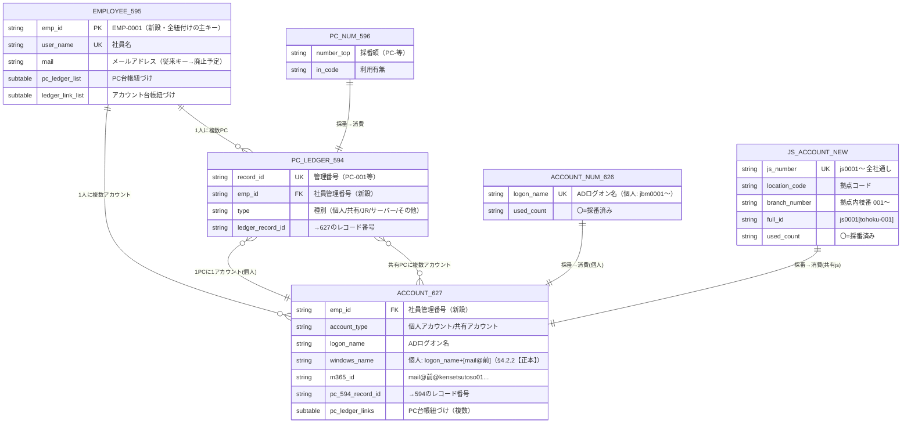
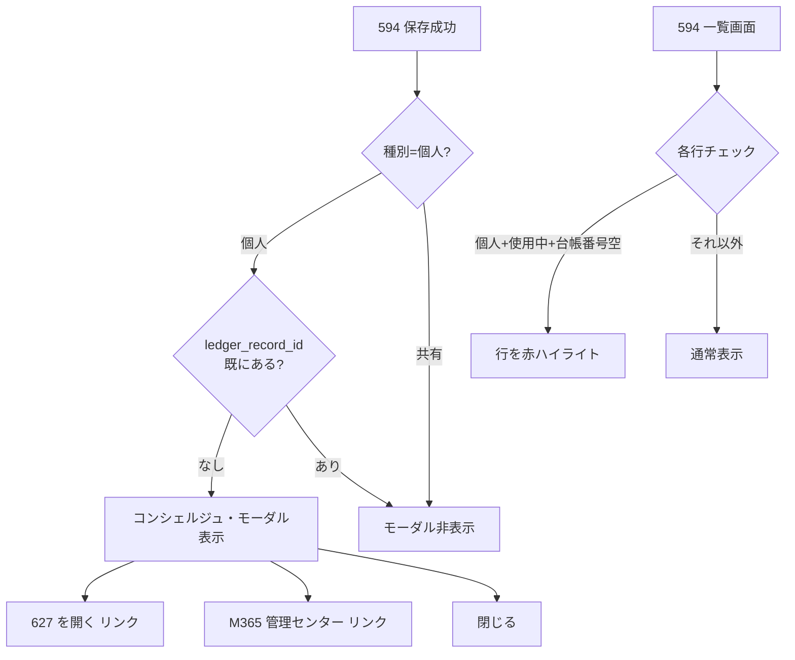

# EMP-ID 導入 & 共有アカウント(js)採番ルール — 設計書

## 1. 全体相関図（Mermaid）



## 2. EMP-ID（社員管理番号）の設計

### 目的
メールアドレス依存を廃止し、社員マスタ(595)に不変の一意キーを付与する。

### 仕様

| 項目 | 内容 |
|------|------|
| フォーマット | `EMP-[4桁数字]` 例: `EMP-0001` |
| 付番方式 | 595 の新規保存時に自動採番（最大値+1） |
| 格納先 | 595 に `emp_id` フィールドを新設（SINGLE_LINE_TEXT, unique） |
| 既存データ | 既存社員にも一括付番スクリプトで遡及適用 |

### 移行計画（段階的）

**Phase A（安全）**: 595 に `emp_id` フィールドを追加。既存レコードに一括付番。594, 627 に `emp_id` フィールドを追加。
**Phase B（並行運用）**: 新規登録時は `emp_id` + `mail` の両方で紐付け。既存のルックアップ（user_name ベース）は維持。
**Phase C（完全移行）**: ルックアップキーを `emp_id` に変更。`mail` ベースの検索を `emp_id` ベースに切り替え。

### リスク
- Phase C はルックアップの再設定が必要（kintone 管理画面での操作）
- 既存の JS カスタマイズ内の `mail` ベース検索を全て `emp_id` ベースに書き換える必要がある
- **推奨**: Phase A + B を先行、Phase C は十分なテスト後

## 3. 共有アカウント(js) 採番ルール

### 命名規則

```
js[4桁数字][ [拠点コード]-[枝番3桁] ]
例: js0001[tohoku-001]
    js0002[honsya-001]
    js0003[tohoku-002]
```

### 拠点コード一覧

| コード | 拠点 |
|--------|------|
| honsya | 本社 |
| tohoku | 東北 |
| kan-etsu | 関越 |
| tokyo | 東京 |
| tokai | 東海 |
| reform | リフォーム |
| tekko | 鉄工 |
| wangan | 湾岸 |

### 採番ロジック

1. **全社通し番号**: js0001, js0002, ... — 全拠点で共通のインクリメント
2. **拠点内枝番**: [tohoku-001], [tohoku-002], ... — 拠点ごとのインクリメント
3. **WindowsID**: `js[4桁数字]` と同一
4. **初期パスワード**: `js[4桁数字]` と同一

### 必要なアプリ変更

新規アプリ「共有アカウント採番マスタ」が必要（または 626 にレコード追加）。

**案A**: 626 にレコード追加（`logon_name` = `js0001` 等）
  - メリット: アプリ数を増やさない
  - デメリット: 個人/共有が混在する

**案B**: 新アプリ作成（推奨）
  - フィールド: js_number, location_code, branch_number, full_id, used_count
  - メリット: 個人と共有が明確に分離
  - デメリット: アプリ数が増える

## 4. コンシェルジュ・フロー



## 5. 赤ハイライトの条件

| 条件 | フィールド | 値 |
|------|-----------|-----|
| 種別 | type | `個人` |
| 状態 | status | `使用中` |
| アカウント台帳番号 | ledger_record_id | **空** |

3条件すべてを満たすレコードのみ、一覧の行を赤くハイライトする。

## 6. 実装優先度

| 優先度 | 機能 | リスク | 工数 |
|--------|------|--------|------|
| 1（済） | 赤ハイライト | 低 | 済 |
| 2（済） | コンシェルジュ | 低 | 済 |
| 3 | EMP-ID Phase A（フィールド追加+一括付番） | 中 | 半日 |
| 4 | 共有アカウント js 採番マスタ作成 | 中 | 半日 |
| 5 | EMP-ID Phase B（並行運用） | 中 | 1日 |
| 6 | EMP-ID Phase C（完全移行） | 高 | 要計画 |
