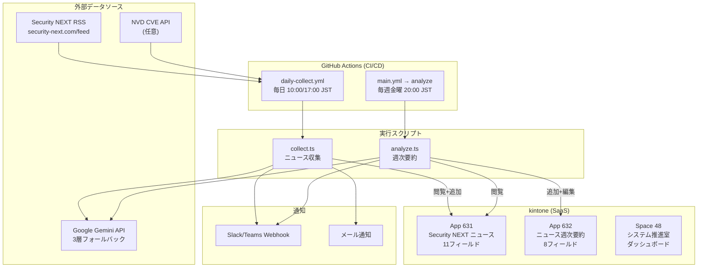
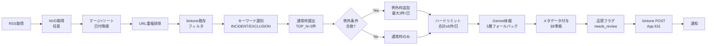
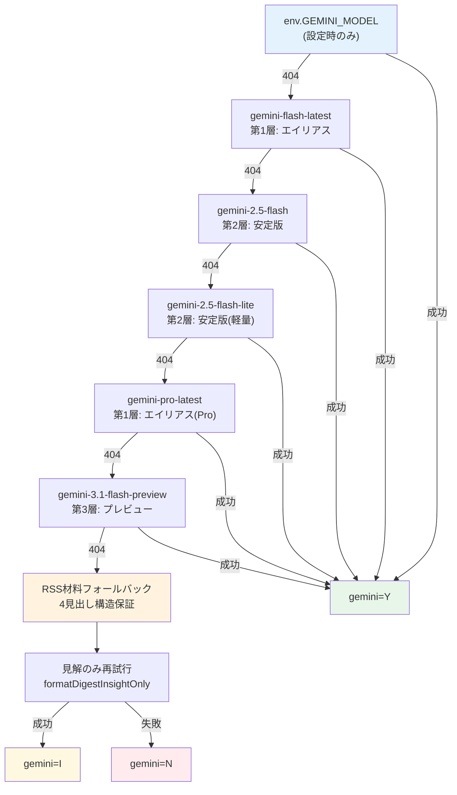
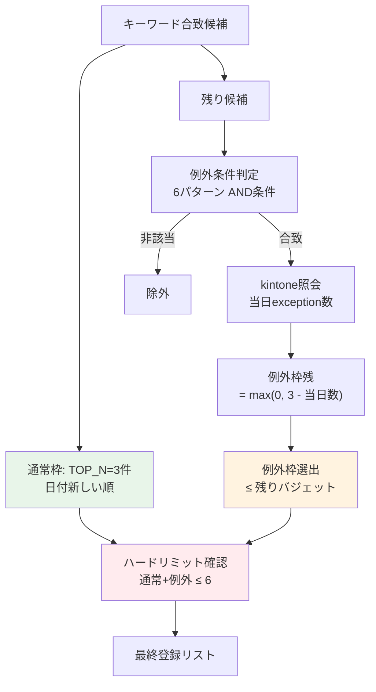
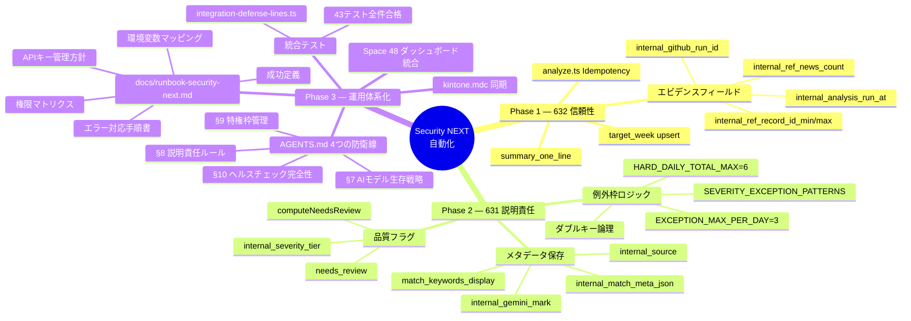

# Security NEXT 自動化 — 最終システム構成図

> **2026 年 4 月版 — Phase 1〜3 完遂**
>
> 本ドキュメントはプロジェクト全フェーズの成果物を俯瞰する最終アーキテクチャである。

---

## 1. システム全体構成



---

## 2. collect.ts 内部パイプライン



---

## 3. Gemini モデルフォールバック（§7）



---

## 4. 例外枠ダブルキー論理（§9）



---

## 5. フォーム検証（§10・手動）

定期の `space-health-report` 自動化は **廃止**。フィールドの正は **`npm run app:fields`** と `field-codes.ts` の突合、および `kintone-apps.md` のアプリ台帳で担保する。

---

## 6. フェーズ別成果物マップ



---

## 7. ファイル構成（Phase 1-3 成果物）

```
GitHub-Actions/
├── AGENTS.md                          ← 開発憲法（4つの防衛線）
├── kintone-apps.md                    ← アプリ正本カタログ
├── .cursor/rules/
│   ├── kintone.mdc                    ← 防衛線準拠の補足ルール
│   ├── kintone-javascript.mdc
│   └── snyk-security.mdc
├── .github/workflows/
│   ├── daily-collect.yml              ← 日次収集（10:00/17:00 JST）
│   └── main.yml                       ← 週次要約（金曜 20:00 JST）
├── scripts/
│   └── （各種メンテ・デプロイスクリプト）
├── docs/
│   ├── final-architecture.md          ← 本ファイル
│   ├── runbook-security-next.md       ← 運用ランブック（Phase 3）
│   ├── phase2-631-collect-improvements.md
│   └── maintenance-template.md
└── security-next-automation/
    ├── README.md
    ├── src/
    │   ├── collect.ts                 ← 日次収集（Phase 2 強化済み）
    │   ├── analyze.ts                 ← 週次要約（Phase 1 強化済み）
    │   ├── lib/
    │   │   ├── field-codes.ts         ← フィールドコード正本
    │   │   ├── format-news-gemini.ts  ← Gemini 3層フォールバック
    │   │   ├── collect-enrich.ts      ← 体裁+品質フラグ
    │   │   ├── collect-pipeline.ts    ← パイプラインログ
    │   │   └── ...
    │   └── __tests__/
    │       └── integration-defense-lines.ts  ← 43件の防衛線テスト
    └── docs/
        ├── security-next-news-app-design.csv
        └── security-next-weekly-report-app-design.csv
```

---

## 8. kintone アプリフィールド構成

### App 631 — Security NEXT ニュース（11 フィールド）

| # | フィールドコード | 型 | Phase | 用途 |
|---|---|---|---|---|
| 1 | `title` | SINGLE_LINE_TEXT | 初期 | 記事タイトル |
| 2 | `article_url` | SINGLE_LINE_TEXT | 初期 | 記事 URL（重複判定キー） |
| 3 | `published_date` | DATE | 初期 | RSS 公開日（JST） |
| 4 | `summary` | MULTI_LINE_TEXT | 初期 | 概要（1-2 文） |
| 5 | `digest` | MULTI_LINE_TEXT | 初期 | 要約（4 見出し構造） |
| 6 | `match_keywords_display` | SINGLE_LINE_TEXT | Phase 2 | マッチキーワード（表示用） |
| 7 | `internal_match_meta_json` | MULTI_LINE_TEXT | Phase 2 | マッチ詳細 JSON（監査用） |
| 8 | `internal_source` | SINGLE_LINE_TEXT | Phase 2 | rss / nvd |
| 9 | `internal_gemini_mark` | SINGLE_LINE_TEXT | Phase 2 | Y / I / N |
| 10 | `needs_review` | CHECK_BOX | Phase 2 | 品質フラグ |
| 11 | `internal_severity_tier` | SINGLE_LINE_TEXT | Phase 2 | normal / exception |

### App 632 — ニュース週次要約（8 フィールド）

| # | フィールドコード | 型 | Phase | 用途 |
|---|---|---|---|---|
| 1 | `target_week` | DATE | Phase 1 | 対象週の月曜日（Idempotency キー） |
| 2 | `weekly_trend` | RICH_TEXT | 初期 | 今週の傾向と対策（HTML） |
| 3 | `summary_one_line` | SINGLE_LINE_TEXT | Phase 1 | 1 行サマリー（通知・ポータル用） |
| 4 | `internal_ref_news_count` | NUMBER | Phase 1 | 参照した 631 レコード数 |
| 5 | `internal_ref_record_id_min` | NUMBER | Phase 1 | 参照レコード $id 最小値 |
| 6 | `internal_ref_record_id_max` | NUMBER | Phase 1 | 参照レコード $id 最大値 |
| 7 | `internal_analysis_run_at` | DATETIME | Phase 1 | 実行日時 |
| 8 | `internal_github_run_id` | SINGLE_LINE_TEXT | Phase 1 | GitHub Actions Run ID |

---

## 9. 4 つの防衛線（AGENTS.md §7-§10）

| # | 防衛線 | 守るもの | 主な仕組み |
|---|--------|---------|-----------|
| §7 | AI モデル生存戦略 | モデル信頼性 | 3 層フォールバック、廃止モデル禁止、404 自動切替 |
| §8 | 説明責任ルール | 監査性 | メタデータ必須保存、`needs_review` 複合条件、キーワード変更手続き |
| §9 | 特権枠管理 | 重大性ガードレール | 例外枠 3 件/日、ハード上限 6 件/日、ダブルキー論理 |
| §10 | ヘルスチェック完全性 | 総体整合性 | API 接続 + スキーマ検証、自己修復フロー、Space 48 同期 |

---

## 10. プロジェクト完了宣言

本プロジェクトは 2026 年 4 月 12 日をもって全 3 フェーズを完遂した。

| フェーズ | 完了コミット | 内容 |
|----------|------------|------|
| Phase 1 | `d376782` | 632 Idempotency・エビデンスフィールド・1 行サマリー |
| Phase 2 | `0cf6eb5` | 631 メタデータ・例外枠・品質フラグ |
| Phase 2+ | `17e7960` | ヘルスチェックにフィールド検証を追加 |
| Phase 3a | `5a4d57c` | AGENTS.md 4 つの防衛線 |
| Phase 3b | `9d3034e` | ランブック・統合テスト（43 件合格） |
| Close | 本コミット | 憲法ロック・最終アーキテクチャ |

以降の変更は AGENTS.md の改訂手続きに従うこと。
