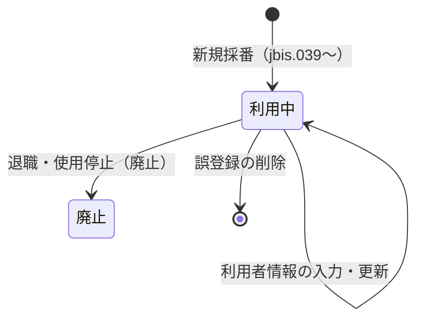

# Apple ID 管理 — kintone 仕様書（SPEC）

> **起票**: 2026-06-02 (火)  
> **状態**: **仕様確定 — 作成 GO 済**（2026-06-02 浜田）  
> **作成日**: **2026-06-03（水）** — kintone アプリ作成・フィールド・移行  
> **本番運用開始**: **2026-06-04（木）** — **kintone のみ**。Excel **使用停止・削除**
> **配置**: [Space 21](https://jbis-kintone.cybozu.com/k/#/space/21)（PC・M365 系と同エリア / thread **23** 既定）  
> **移行元 Excel**: `C:\tmp\appleID管理一覧\apple_ID一覧20210106.xlsx`（2026-06-01 更新）  
> **参照分析**: `docs/plans/tmp-apple-id-xlsx-structure.json`（機械確認・秘匿マスク済み）

---

## §0. 進め方（浜田合意 2026-06-02）

1. **本書で項目・運用・フィールドを確定**する（いまここ）。
2. 浜田 GO 後に **kintone アプリ作成**（`.cursor/rules/creation-timing-ask.mdc`）。
3. フィールド投入 → **Excel 移行** → **ダッシュ customize** → 印刷 → 目視確認。

**技術方針**（予実 677/678・PC 台帳 674 と同型）:

- **データアプリ** = 正本（Excel `icloud` 相当）。
- **ダッシュアプリ** = 日常の Excel 風 UI（**JS + REST API** でデータアプリへ書込）。
- **有償プラグイン NG**。標準フィールド + customize のみ。

---

## §1. 背景・目的

### 1.1 背景

- 業務携帯用 Apple ID を **Excel ブック**（`icloud` シート）で管理している。
- 約 **1,146 行**（うち **約 251 行**が氏名・MDM・回線まで入力済、残りは **ID のみ**）。
- 印刷用に **`ユーザ印刷用`** シートで利用者への手渡し用レイアウトを都度作っている。

### 1.2 目的

1. **Excel と同等の台帳**を kintone に置き、**日常操作はダッシュ**で行う。
2. **新規 Apple ID 採番**を `jbis.{3桁}@icloud.com` で自動化（起点 **`jbis.039`**）。
3. **固定パスワード・ロックパス**を自動設定し、手入力ミスを防ぐ。
4. **利用者印刷**をダッシュから出力（Excel `ユーザ印刷用` 相当）。

### 1.3 スコープ外（v1）

| 項目 | 理由 |
|------|------|
| **Android シート**（Google アカウント 1 件） | 別ドメイン・別運用。必要なら **フェーズ2** |
| **PC 台帳 674 との自動連携** | v1 は独立台帳。リンクは **将来検討** |
| **旧 `kent.*@icloud.com` の新規採番** | **移行データのみ**（新規は `jbis.*` のみ） |
| Excel 継続運用 | 移行完了後は **kintone のみ**（**2026-06-04 以降 Excel 削除**） |

---

## §2. 用語

| 用語 | 意味 |
|------|------|
| **データアプリ** | 1 Apple ID = 1 レコードの正本（アプリ名: **Apple ID管理台帳用DB**） |
| **ダッシュアプリ** | 一覧・採番・編集・印刷の主画面（アプリ名: **Apple ID管理台帳**） |
| **利用中** | Apple ID が **有効**（利用者未入力の ID プール行も含む） |
| **廃止** | Apple ID を **使用停止**した状態 |
| **legacy_no** | Excel の **No.** 列（通し番号。印刷・社内照合に使用） |
| **MDM名** | Excel **`MDMアカウント名`**（icloud）および **`社員番号`**（ユーザ印刷用）に相当する **1 フィールド**（`mdm_name`） |
| **氏名** | **姓 + 全角スペース + 名** の 1 文字列（例: `山田　太郎`） |

---

## §3. Excel 移行元の整理

### 3.1 利用シート（確定）

| シート | 行数（目安） | kintone での扱い |
|--------|-------------|------------------|
| **icloud** | データ **1,146 行** | **全行移行** → データアプリ |
| **ユーザ印刷用** | データ **11 行** | **独立データではない**。icloud の **最新割当の印刷テンプレ**相当 → **ダッシュ印刷機能**で再現 |

### 3.2 icloud 列 → kintone マッピング

| Excel 列名 | 必須 | 移行時の埋まり | kintone フィールド | 備考 |
|-------------|------|----------------|-------------------|------|
| **No.** | ○ | 1,146 | `legacy_no` | 数値。新規採番時は **max+1** |
| **登録日** | — | 251 | `registered_date` | 移行時 Excel 値。**現行端末／MDMでの登録日**（§8.3） |
| **端末交換日** | — | — | `device_exchange_date` | 任意。端末買い替え時に入力（iPhone・iPad 共通） |
| **MDMアカウント名** | 入力時 | 251 | `mdm_name` | |
| **姓** + **名** | 入力時 | 251 | `user_name` | **`{姓}　{名}`**（全角スペース）に結合 |
| **回線番号** | 入力時 | 251 | `phone_number` | ハイフン付き文字列 |
| **アップルID** | ○ | 1,146 | `apple_id` | **unique** |
| **パスワード** | 自動 | 251 | `password` | 固定 **`Honten00`** |
| **ロックパス** | 自動 | 251 | `lock_passcode` | 固定 **`2511`** |
| （列 L **端末種別**） | 任意 | 多数 | `device_type` | `iPhone` / `iPad` / その他 |
| — | ○ | — | `status` | 移行時は原則 **`利用中`**（§5） |

**移行時に取り込まない列**:

- 列 B **OK** → **フィールドなし**（浜田確定 2026-06-02）

**移行スクリプトの補完**:

- `password` / `lock_passcode` が空 → **`Honten00` / `2511`**
- `user_name` → 姓・名の両方があるとき **`姓 + \u3000 + 名`**。片方のみの行は **そのまま 1 文字列**（要目視サンプル）
- `status` → 原則 **`利用中`**（Excel に廃止相当の判別列が無いため）

### 3.3 ユーザ印刷用との差分

| icloud | ユーザ印刷用 | 統一方針 |
|--------|-------------|----------|
| MDMアカウント名 | 社員番号 | **`mdm_name`（MDM名）** 1 本 |
| 姓・名（別列） | 姓・名（別列） | **`user_name`（氏名）** 1 本 |
| 同一構成 | 同一 | 印刷テンプレは **1 種類** |

---

## §4. アプリ構成

```
Space 21
├── Apple ID管理台帳用DB（データアプリ） … 正本・API 書込先
└── Apple ID管理台帳（ダッシュアプリ） … customize 一覧・操作 UI
```

| 役割 | 予実での例 | 本案件（アプリ名） |
|------|-----------|-------------------|
| データ | **677** | **Apple ID管理台帳用DB**（App ID は作成後 `kintone-apps.md` に追記） |
| ダッシュ | **678** | **Apple ID管理台帳** |

**データの正**: データアプリのレコード。**日常操作はダッシュのみ**（677/678 と同型）。

**書込経路（浜田確定 2026-06-02 — 案 B）**:

- **登録・修正・廃止・削除** → **すべてダッシュ（Apple ID管理台帳）から REST API のみ**。
- **Apple ID管理台帳用DB** の kintone 標準 UI からの **保存・削除は全面禁止**（677 型 customize で `event.error`）:
  - 詳細・追加画面の **保存**
  - 一覧の **インライン編集・一括編集**
  - 詳細・一覧からの **レコード削除**（PC／モバイル含む）
  - プロセス管理の **ステータス進行**
- DB アプリは **閲覧・目視確認・リンク参照**のみ可。
- **初回移行** → Node スクリプト + REST（一括 POST）。移行スクリプトは UI ブロックの外。

---

## §5. ステータスとライフサイクル

### 5.1 ステータス（DROP_DOWN `status`）— 浜田確定 2026-06-02

| 値 | 意味 |
|----|------|
| **利用中** | Apple ID **有効**（利用者情報の有無は問わない） |
| **廃止** | Apple ID **使用停止** |

**既定値**: 新規採番・移行とも **`利用中`**。

**ID プール**（氏名・MDM・回線が空）も **`利用中`**。未割当 ID の判別は **`user_name` が空** 等でフィルタする（§9）。

### 5.2 操作フロー



| 操作 | 実行者 | 内容 |
|------|--------|------|
| **新規採番** | 管理者 | 次の `jbis.*` ID、`password`、`lock_passcode`、`legacy_no`、`registered_date=当日`、`status=利用中` |
| **編集** | 管理者 | **Apple ID**（登録ミス修正時のみ）・MDM名・氏名・回線・端末種別・メモを更新 |
| **廃止** | 管理者 | **`status=廃止`**（退職・使用停止。**レコードは削除しない**） |
| **削除** | 管理者 | **誤登録**の行のみ REST DELETE（確認ダイアログ必須） |
| **印刷** | 管理者 | 選択行を `ユーザ印刷用` レイアウトで `window.print()` |

### 5.3 運用ルール（浜田確定 2026-06-02）

| 状況 | 操作 | 備考 |
|------|------|------|
| **新規 ID 確保・利用者割当** | ダッシュで **採番 → 編集** | DB 画面では不可 |
| **入力ミス・重複など誤登録** | ダッシュで **削除** | 物理削除。`apple_id` の unique が解放される |
| **退職・端末返却・ID 使用停止** | ダッシュで **廃止** | **`status=廃止`**。履歴として **レコードを残す**（削除しない） |
| **廃止済み ID の再利用** | v1 では **想定しない** | 必要ならフェーズ2 |

**削除 vs 廃止の使い分け**:

- **削除** = そもそも登録が間違っていた行（採番直後の誤り、テスト行など）。
- **廃止** = 一度運用した ID の **使用停止**（**退職時は必ずこちら**）。

ダッシュの **削除**確認では、**氏名・MDM が入っている行**には追加警告を出す（「退職の場合は **廃止** を使ってください」）。

**返却日・返却ステータスは持たない**（浜田確定）。

---

## §6. 採番ルール（確定 2026-06-02）

| 項目 | 内容 |
|------|------|
| **形式** | `jbis.{3桁ゼロ埋め}@icloud.com` |
| **次の新規 ID** | **`jbis.039@icloud.com`** |
| **034〜038** | **意図的にスキップ** |
| **アルゴリズム** | `next = max(39, 既存 jbis 番号の最大 + 1)` を 3 桁ゼロ埋め |
| **旧形式** | `kent.*` / その他は **移行のみ** |
| **一意性** | `apple_id` フィールド **unique: true** |

**legacy_no（No.）**:

- 移行: Excel の No. をそのまま `legacy_no` へ。
- 新規: **max(legacy_no) + 1**。

---

## §7. 固定認証情報（確定）

| 項目 | 値 | UI |
|------|-----|-----|
| パスワード | **Honten00** | 新規時 **自動セット**。ダッシュ **平文表示**（Excel 同様・**IT 管理者向け**・クリックでコピー可） |
| ロックパス | **2511** | 同上 |

**セキュリティ前提**（浜田判断）:

- 業務携帯・**業務外利用限定**のため Excel 同様 kintone に保持。
- アプリ権限は **IT 管理者のみ**。
- 監査: kintone 標準の **更新日時・更新者**。

---

## §8. データアプリ — フィールド一覧（確定案 2026-06-02）

### 8.1 フィールド定義（**12 項目**）

| # | ラベル | コード | 型 | 必須 | unique | 入力・既定 |
|---|--------|--------|-----|------|--------|------------|
| 1 | 管理番号 | `legacy_no` | 数値 | ○ | ○ | 採番時自動 |
| 2 | ステータス | `status` | ドロップダウン | ○ | — | 既定 **利用中** |
| 3 | 登録日 | `registered_date` | 日付 | ○ | — | **現在の端末／MDMでの登録日**（§8.3） |
| 4 | 端末交換日 | `device_exchange_date` | 日付 | — | — | 端末買い替え時に入力（iPhone・iPad 共通） |
| 5 | MDM名 | `mdm_name` | 文字列(1行) | — | — | ダッシュ入力 |
| 6 | 氏名 | `user_name` | 文字列(1行) | — | — | **`姓　名`（全角スペース）**（§8.2） |
| 7 | 回線番号 | `phone_number` | 文字列(1行) | — | — | ダッシュ入力 |
| 8 | Apple ID | `apple_id` | 文字列(1行) | ○ | ○ | 採番時自動 |
| 9 | パスワード | `password` | 文字列(1行) | ○ | — | 自動 |
| 10 | ロックパス | `lock_passcode` | 文字列(1行) | ○ | — | 自動 |
| 11 | 端末種別 | `device_type` | ドロップダウン | — | — | `iPhone` / `iPad` / `その他` |
| 12 | メモ | `note` | 文字列(複数行) | — | — | 任意 |

**ドロップダウン**:

- `status`: **利用中** / **廃止**
- `device_type`: iPhone / iPad / その他

**採用しないフィールド**（浜田確定）:

- ~~`legacy_ok`~~
- ~~`returned_date`~~
- ~~`family_name` / `given_name`~~（`user_name` に統合）

### 8.2 氏名（`user_name`）の形式

- **正**: `姓` + **全角スペース（U+3000）** + `名` — 例: **`山田　太郎`**
- **入力 UX（ダッシュ）**: 実装は **1 テキストボックス**（Excel と同様に 1 列で見せる）。保存前に **全角スペース未含有**なら警告（強制は soft）。
- **移行**: Excel **姓・名** → **`{姓}\u3000{名}`** で結合。

### 8.3 登録日（`registered_date`）・端末交換日（`device_exchange_date`）

- **意味**: `registered_date` は **現在の端末／MDMでの登録日**（初回割当・端末買い替え時に更新）。
- **新規採番**: API POST 時に **当日（JST）** をセット。
- **プール割当**（未割当行への初回入力）: **当日（JST）** をセット（既存実装）。
- **移行**: Excel **登録日**があればその日付を維持。`device_exchange_date` は空のまま。
- **編集保存**: **MDM名が前回と異なる**場合 → `registered_date` を **当日（JST）** に更新し、**端末交換日の入力を促す**（未入力時は確認ダイアログで今日をセットするか入力欄へ戻す）。
- **氏名・回線・メモのみの編集**では `registered_date` を更新しない。

### 8.4 バリデーション

- `apple_id`: 新規採番は `^jbis\.\d{3}@icloud\.com$`。移行 `kent.*` 等は `^[\w.-]+@icloud\.com$` を許容。**legacy 業務メール**（例: `hayasaka_j-bis@au.com`）は `^[\w.-]+@[\w.-]+\.[a-z]{2,}$` を許容（2026-06-06）。
- `phone_number`: 数字とハイフン（soft validate）。

### 8.5 一覧の既定ソート

1. **`status`** — **利用中**を上、**廃止**を下（またはフィルタで **利用中のみ** 既定）
2. **`legacy_no` 降順**

---

## §9. ダッシュアプリ — UI 要件（案）

### 9.1 画面構成

| 領域 | 内容 |
|------|------|
| **ヘッダ** | タイトル・**再読み込み**・**新規採番** |
| **フィルタ** | すべて / **利用中** / **廃止** / **未割当**（`user_name` 空かつ利用中） |
| **検索** | Apple ID・氏名・MDM名・回線 |
| **表** | §9.2 の列 |
| **行操作** | **編集** / **廃止** / **削除** / **印刷** |

### 9.2 表の列（左→右）

`legacy_no` | `status` | `registered_date` | `device_exchange_date` | `mdm_name` | `user_name` | `phone_number` | `apple_id` | `password`* | `lock_passcode`* | `device_type` | 操作

\* **平文表示**（Excel `icloud` 同様。IT 管理者専用・クリックでコピー可）

### 9.3 モーダル

| モーダル | 項目 |
|----------|------|
| **新規採番** | 付与 `apple_id` プレビュー・確定 |
| **編集** | **Apple ID**（登録ミス修正）・**パスワード**・**ロックパス**（空なら標準値）・登録日（表示のみ）・**端末交換日**・MDM名・氏名・回線・端末種別・メモ |
| **廃止** | 確認（Apple ID・氏名表示）→ `status=廃止`（**退職・使用停止**） |
| **削除** | 確認（Apple ID 表示・利用者情報ありなら追加警告）→ REST DELETE（**誤登録**） |

### 9.4 印刷

- **対象**: 選択行（**利用中**推奨）。**PC台帳 674 と同型**の別ウィンドウ帳票（緑テーマ・グリッド表）。
- **レイアウト**: Excel **`ユーザ印刷用`** 相当 — 注意書き（端末種別に応じ iPhone/iPad 文言）→ **端末登録日または端末交換日（どちらか一方）/利用者名** → **回線/iCloud/パスワード** → **Apple ID/パスワード/ロックパス**。MDM行は印刷しない（2026-08-11）。
- **印刷の日付ラベル**: `device_exchange_date` あり → **端末交換日**（その値）。なし（新規）→ **端末登録日**（`registered_date`）。一覧・編集では従来どおり両フィールドを表示。
- **方式**: `window.open` + `document.write` + **`window.print()`**（674 §4.9 移植）。

---

## §10. 移行・運用切替スケジュール（浜田 GO 2026-06-02）

### 10.1 日程

| 日付 | 作業 | 成果 |
|------|------|------|
| **2026-06-03（水）** | kintone **アプリ作成**（DB + ダッシュ）・フィールド deploy・DB save/delete ブロック customize・Excel **一括移行**・ダッシュ MVP（採番・編集・廃止・削除）・浜田 **目視確認** | テナント上でデータ投入済み |
| **2026-06-04（木）〜** | **kintone のみで運用開始**。Excel **使用停止** | 日常操作は **Apple ID管理台帳**（ダッシュ）のみ |
| **2026-06-04（木）** | 移行突合 OK 後、Excel ファイル **削除** | `apple_ID一覧20210106.xlsx` をローカルから削除（下記 §10.3） |

### 10.2 6/3 当日の作業順（AI 実行）

1. **Apple ID管理台帳用DB** 作成（Space 21）+ フィールド §8 deploy。
2. DB customize — 保存・削除 **全面ブロック**（677 型）。
3. Excel `icloud` → REST 一括 POST（**登録済み約 251 行**。`jbis.039`〜`933` の ID のみプール行は移行しない）。
4. 移行検証: 件数・`apple_id` unique・`user_name` 結合サンプル・次採番 **jbis.039**。
5. **Apple ID管理台帳**（ダッシュ）作成 + customize（一覧・採番・編集・廃止・削除）。
6. 印刷（可能なら同日、無ければ 6/4 午前）。
7. `kintone-apps.md` 追記・浜田 **目視 GO**。

**着手前ゲート**: §50-3-8（採番・API・削除ロジック前）。

### 10.3 Excel 削除（2026-06-04）

**方針（浜田 2026-06-02）**: 6/4 から **Excel は使わない**。移行突合が取れたら **ファイルを削除**する。

| 対象 | パス（移行元） | 6/4 の扱い |
|------|----------------|------------|
| 正本ブック | `C:\tmp\appleID管理一覧\apple_ID一覧20210106.xlsx` | **削除**（使用停止後） |
| フォルダ | `C:\tmp\appleID管理一覧\` | 中身が空なら **フォルダごと削除**可 |

**削除前チェック（6/3 夜〜6/4 朝）**:

- [ ] kintone レコード数 ≒ **1,146**
- [ ] 割当済行（氏名あり）≒ **251** 前後
- [ ] ダッシュで **採番・編集・廃止・削除** が動作
- [ ] 浜田 **目視 GO**

**補足**: 削除は **ローカル PC 上の Excel のみ**。kintone 側に正本が移った後の整理。社内他 PC に同ブックのコピーがあれば、**6/4 以降そちらも使用停止・削除**を周知する。

### 10.4 移行後

- **運用の正**: kintone **のみ**（§3・§4）。
- Excel への **書き戻し・二重管理は行わない**。

### 10.5 移行後チェック — jbis プール行（P6 GO 2026-06-03）

移行直後、**氏名未入力の jbis.039〜933 プール行**が DB に残るとダッシュが混乱する。

| # | 確認 | 期待 |
|---|------|------|
| 1 | `npm run apple-id:record-count` | 割当済み行数（目安 **251**） |
| 2 | 694 一覧 | **未割当プール行が大量に見えない** |
| 3 | 次採番バナー | **`jbis.039@icloud.com`**（POST 新規作成） |
| 4 | プール残存時 | 浜田 GO → `npm run apple-id:wipe-jbis-pool`（**dry-run 必須**） |
| 5 | 再確認 | record-count 再実行・694 目視 OK |

**注意**: 移行スクリプトは **user_name 空の jbis.039〜933 を skip** するが、旧データや手動投入でプール行が残りうる。**10.5 を必ず実施**。

---

## §11. 実装フェーズ（作成 GO 後）

| Phase | 内容 |
|-------|------|
| **P0** | 本 SPEC 確定 |
| **P1** | データアプリ + フィールド + **DB 用 save/delete ブロック customize** |
| **P2** | Excel 移行 |
| **P3** | ダッシュ（一覧・採番・編集・廃止・**削除**） |
| **P4** | 印刷 |
| **P5** | 権限・runbook・`kintone-apps.md` |

**着手前ゲート**: 浜田 GO / §50-3-8（採番・API 前）。

---

## §12. 未確定事項（§41）

| ID | 論点 | 状態 |
|----|------|------|
| ~~**Q1**~~ | **アプリ名** | **確定** — DB: **Apple ID管理台帳用DB** / ダッシュ: **Apple ID管理台帳**（浜田 2026-06-02） |
| ~~**Q2**~~ | **DB 直接編集** | **確定 — 案 B（全面禁止）**。登録・修正・廃止・削除は **すべてダッシュ**（浜田 2026-06-02） |
| ~~**Q3**~~ | **作成 GO・運用開始** | **確定** — 作成 **6/3（水）** / 運用 **6/4（木）〜 kintone のみ** / Excel **6/4 削除** |

---

## §13. 確定サマリ

| 項目 | 確定値 |
|------|--------|
| データアプリ名 | **Apple ID管理台帳用DB** |
| ダッシュアプリ名 | **Apple ID管理台帳** |
| 配置 | **Space 21** |
| 構成 | **データ + ダッシュ** |
| フィールド数 | **11**（legacy_ok・返却日・姓/名分割なし） |
| 氏名 | **`user_name`** = 姓 + 全角スペース + 名 |
| MDM | **`mdm_name`（MDM名）** |
| ステータス | **利用中 / 廃止** |
| 登録日 | **現在の端末／MDMでの登録日**（MDM変更時に当日へ更新） |
| 端末交換日 | 端末買い替え時に入力（任意） |
| 書込経路 | **ダッシュ API のみ**（DB 標準 UI は閲覧のみ） |
| 削除 | **誤登録のみ**（ダッシュ DELETE） |
| 退職・使用停止 | **`status=廃止`**（削除しない） |
| 採番起点 | **`jbis.039@icloud.com`** |
| 固定 PW / ロック | **Honten00 / 2511** |
| 作成 GO | **2026-06-03（水）** — アプリ作成・移行 |
| 運用開始 | **2026-06-04（木）〜** — **kintone のみ** |
| Excel | **6/4 使用停止・ファイル削除** |
| 固定 PW / ロック | **Honten00 / 2511** |

**§12 未確定事項: なし（仕様確定）**

---

## §14. 明日（6/3）の AI 作業メモ

浜田 **GO 待ち不要**（作成日確定）。6/3 セッション開始時:

1. `docs/plans/2026-06-02-apple-id-kintone-spec.md`（本書）を正本として実装。
2. §50-3-8 → preflight → Space 21 に **Apple ID管理台帳用DB** / **Apple ID管理台帳** 作成。
3. 移行完了・目視 OK まで。**6/4 朝**: Excel 削除チェックリスト §10.3。

---

## 変更履歴

| 日付 | 内容 |
|------|------|
| 2026-06-02 | 初版 |
| 2026-06-02 | 浜田反映: legacy_ok 削除、氏名統合、status 2 値、登録日・MDM名、返却日削除 |
| 2026-06-02 | アプリ名確定: **Apple ID管理台帳用DB** / **Apple ID管理台帳** |
| 2026-06-02 | 案 B 確定: DB 全面ブロック、ダッシュで CRUD+削除、退職は廃止 |
| 2026-06-03 | **jbis.039〜933 プール行**は kintone に載せない（移行・台帳とも未割当 ID のみ行は除外） |
| 2026-06-03 | 印刷: **674 型別ウィンドウ帳票** + Excel `ユーザ印刷用` レイアウト |
| 2026-06-03 | §10.5 移行後チェック（jbis プール行・wipe 条件）— 夕反省 P6 GO |
