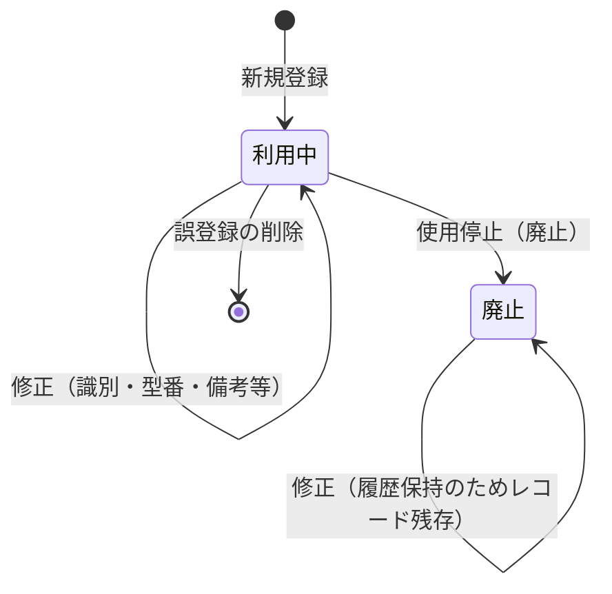

# ソフトウェア管理台帳 — kintone 仕様書（SPEC）

> **起票**: 2026-06-13 (土)  
> **状態**: **SPEC GO 済**（2026-06-13 初版 浜田 + **2026-06-14 Q&A 追確認** 浜田）。**kintone 作成 GO は未実施**  
> **Q&A 関門**: `docs/runbooks/kintone-ledger-spec-qa-checklist.md`（R19 — **2026-06-14 完走**）  
> **配置**: [Space 21](https://jbis-kintone.cybozu.com/k/#/space/21)（PC・M365・Apple ID と同エリア / thread **23** 想定）  
> **参照パターン**: Apple ID [694](https://jbis-kintone.cybozu.com/k/694/) 型（DB 正本 + Dash Excel UI / REST 書込）

---

## §0. 進め方

1. **本書で項目・運用・フィールドを確定**する（**完了 — 2026-06-13 初版 + 2026-06-14 Q&A #1〜#9 追確認**）。
2. 浜田 GO 後に **kintone アプリ作成**（`.cursor/rules/creation-timing-ask.mdc`）。
3. フィールド投入 → **ダッシュ customize** → 目視確認 → 各所属システム担当へ周知。

**技術方針**（Apple ID 693/694・共有メール 695/696 と同型）:

| 構成 | 役割 |
|------|------|
| **データアプリ** | 1 ソフトウェア割当 = 1 レコードの正本 |
| **ダッシュアプリ** | 日常の Excel 風 UI（JS + REST でデータアプリへ書込） |
| **有償プラグイン** | **NG**（標準フィールド + customize のみ） |
| **DB 標準 UI** | 保存・削除 **全面禁止**（閲覧のみ。693 型 customize） |

**v1 スコープ**: **ソフトウェア管理台帳のみ**。記憶媒体等管理台帳は **v1 安定後**に別 SPEC。

---

## §1. 背景・目的

### 1.1 背景

- 部署単位でソフトウェアライセンス（買い切り・サブスク・ボリューム等）を管理する必要がある。
- **各所属のシステム担当**が、担当範囲のライセンスを台帳化する（本社/支店/営業所の一元ドロップダウンは **持たない**）。
- 識別子は製品により **シリアル / プロダクトID / アカウントID / 製造番号** 等が混在し、**1 製品に 2〜3 種**ある場合がある。

### 1.2 目的

1. **694 型 Excel 風ダッシュ**で、新規・修正・廃止・削除を日常操作できる台帳を置く。
2. **595 社員マスタ**と連携し、**1 ソフトウェア割当 = 1 レコード**（利用者は **必ず 1 名**。同一社員に **複数レコード可**）で記録する。
3. 所属・グループは **595 から自動引用**し、**支店・営業所単位**および **社員単位**で一覧・リスト出力・印刷できるようにする（§9.5）。

### 1.3 スコープ外（v1）

| 項目 | 理由 |
|------|------|
| **ライセンス数・在庫数管理** | 台帳は **割当記録**のみ。枚数管理は行わない |
| **`organization`（手入力ドロップダウン）** | 支店・営業所は **595 引用の `dept_name` / `group_name` + ダッシュ UI** で表現（§9.5）。台帳に別フィールドは持たない |
| **`wf_reference`（WF 連携）** | WF は別システム。台帳に持たない |
| **PC 台帳 674 との自動連携** | v1 は独立台帳。**v2 で参照検討**（§11） |
| **記憶媒体等管理台帳** | SPEC 確定済（`2026-06-13-storage-media-ledger-kintone-spec.md`）。**kintone 作成は本台帳 v1 安定後** |
| **マニュアル整備** | 運用説明は口頭でマニュアル担当へ依頼（台帳 SPEC の対象外） |
| **680 所属候補マスタ** | PC台帳 **共有・JR** 用（App 680）。本台帳は **595 必須**のため **v1 不要**（2026-06-14 浜田確認） |

---

## §2. 用語

| 用語 | 意味 |
|------|------|
| **データアプリ** | 正本（アプリ名: **ソフトウェア管理台帳用DB**） |
| **ダッシュアプリ** | 一覧・登録・編集の主画面（アプリ名: **ソフトウェア管理台帳**） |
| **legacy_no** | 管理番号（694 の No. 相当）。新規は **max+1** |
| **識別スロット** | `id_kind_N` + `id_value_N` の組（最大 3 組・案 A） |
| **型番** | 製品の型・SKU・品番（`model_number`）。**製造番号とは別** |
| **製造番号** | 個体の工場番号。**識別スロットの種別**として登録 |
| **所属名（`dept_name`）** | 595 の所属。**営業所名・支店名・本部部署名**（例: 仙台営業所、東北支店、施工推進部） |
| **所属グループ（`group_name`）** | 595 のグループコード。**支店横断**の絞り込みに使用（例: `tohoku`＝東北支店配下） |
| **利用中 / 廃止** | 694 同型のライフサイクル |

---

## §3. 他台帳との境界

| 対象 | 管理場所 | 備考 |
|------|----------|------|
| **PC・M365・アカウント** | **674 新・PC台帳** | v1 では連携しない |
| **Apple ID** | **694** | 別台帳 |
| **共有メール** | **696** | 別台帳 |
| **本案件：ソフトウェアライセンス割当** | **本台帳（新規）** | 595 連携・1 割当 1 レコード（同社員複数可） |

**運用主体**: 各所属の **システム担当**が自所属分を登録・更新。日常は **所属チップ・検索**で自拠点を絞る（§9.5.1）。

### 3.1 アクセス権限（v1 — 2026-06-14 浜田確定・案 A）

**方針（674 同型）**: 権限を持つ **システム担当**は Dash 上 **全レコードを閲覧・REST 編集可**。拠点ごとの「見える範囲」は **kintone レコード ACL ではなく UI フィルタ**で運用する（v1）。

| 項目 | 内容 |
|------|------|
| **Space** | [Space 21](https://jbis-kintone.cybozu.com/k/#/space/21)（PC・M365・Apple ID・674 と同エリア） |
| **kintone グループ** | **`system`**（システム担当者用・**作成済**） |
| **Space アクセス** | **`system` に Space 21 へのアクセス権を付与済** → **限られたメンバーのみ** Space／配下アプリに到達可 |
| **新規アプリ** | 本台帳 DB + Dash も **Space 21 / thread 23** に配置し、**694・674 と同じ権限帯**（`system` 参加者＝アプリ閲覧・編集）とする |
| **レコード単位 ACL** | **v1 では設けない**（customize によるログインユーザ別非表示は v2 検討） |
| **一般ユーザー** | Space 21 非参加 → **台帳にアクセス不可** |

**作成時チェック**: アプリ追加後、**Space 21 のメンバー／アプリ権限**が 694 等と同等か **目視 1 回**（§12.3）。

---

## §4. アプリ構成

```
Space 21
├── ソフトウェア管理台帳用DB（データアプリ） … 正本・API 書込先
└── ソフトウェア管理台帳（ダッシュアプリ） … customize 一覧・操作 UI
```

| 役割 | 参照例 | 本案件（アプリ名） |
|------|--------|-------------------|
| データ | Apple ID **693** / 共有メール **695** | **ソフトウェア管理台帳用DB** |
| ダッシュ | Apple ID **694** / 共有メール **696** | **ソフトウェア管理台帳** |

**書込経路**（694 型）:

- **登録・修正・廃止・削除** → **すべてダッシュから REST API のみ**。
- データアプリの kintone 標準 UI からの **保存・削除は全面禁止**（閲覧・目視確認のみ）。

---

## §5. ステータスとライフサイクル

### 5.1 ステータス（DROP_DOWN `status`）

| 値 | 意味 |
|----|------|
| **利用中** | ライセンス **有効**（割当中） |
| **廃止** | ライセンス **使用停止**（退職・解約・返却等） |

**既定値**: 新規登録時 **`利用中`**。

### 5.2 操作フロー



| 操作 | 実行者 | 内容 |
|------|--------|------|
| **新規登録** | システム担当 | §7 の必須項目 + 595 選択 + `legacy_no` / `registered_date` 自動 |
| **修正** | システム担当 | 全編集可能フィールドを更新（`registered_date` は変更不可） |
| **廃止** | システム担当 | **`status=廃止`**（**レコードは削除しない**） |
| **削除** | システム担当 | **誤登録**のみ REST DELETE（確認ダイアログ必須） |

**削除 vs 廃止**:

- **削除** = 登録自体が間違っていた行。
- **廃止** = 一度運用した割当の **使用停止**（履歴として残す）。

### 5.3 廃止の不可逆（2026-06-14 浜田確定・案 A）

| ルール | 内容 |
|--------|------|
| **廃止 → 利用中** | **不可**（**終端**）。UI に復帰操作は **持たない** |
| **再利用** | 廃止済みレコードを **別利用者・再割当に流用しない** |
| **再割当の手順** | **新規登録**（新 `legacy_no`・新 `registered_date`） |
| **退職者で廃止した行** | **再利用しない**（後任・同一製品の再割当も **新規登録**） |
| **誤廃止** | **削除**（誤登録扱い・§5.2）または **新規登録**で対応。`status` の戻しはしない |

**実装**: 編集モーダルは **`status=廃止` 行でも表示のみ**（§9.3）。廃止 PUT は **`利用中` → `廃止` のみ**（逆方向 PUT を拒否）。

---

## §6. 595 社員マスタ連携

**参照**: [595 社員マスタ](https://jbis-kintone.cybozu.com/k/595/)（674 同型）

### 6.1 方針

- **新規登録時に 595 から利用者を必ず 1 名選択**する（**1 レコード = 1 割当・利用者 1 名**。同一 `emp_id` の **追加登録可**）。
- 674 と同様、**入力支援**（はい/いいえ → 595 検索）で社員を選び、以下を反映する。

| kintone フィールド | 595 由来 | 備考 |
|-------------------|----------|------|
| `emp_id` | `emp_id` | 社員番号（照合・救済用） |
| `user_name` | `user_name` | 氏名 |
| `dept_name` | `dept_name` | 所属名（フィルタ用） |
| `group_name` | `group_name` | 所属グループ（フィルタ用） |

### 6.2 採用しない 595 項目（v1）

- `mail` / `mail_acct` — PC 台帳側の用途。本台帳では **不要**。

### 6.3 バリデーション

- 新規・修正保存時: **`user_name` 空** → エラー。
- **595 入力支援**（新規・修正の利用者選択）: 検索クエリに **`employment_status not in ("退職")`** を付与（**674 同型**）。退職者は **一覧に出さず選択不可**。

### 6.4 退職者と台帳表示（2026-06-14 浜田確定）

| 場面 | ルール |
|------|--------|
| **595 からの新規・変更で利用者選択** | 退職者は **出さない**（§6.3） |
| **ダッシュ（メイン表・チップ・検索・リスト一覧・社員印刷）** | 割当 **`emp_id` が 595 上で退職** の行は **一切表示しない**（`status=利用中` のままでも非表示） |
| **データアプリ（DB 標準 UI）** | 閲覧のみ。**退職者行もレコードとしては残る**（監査・救済用） |
| **正式停止** | 退職に伴う停止は **`status=廃止`**（§5.2）。v1 では **595 退職イベントの自動 PUT はしない**（表示除外のみ。必要なら担当者が **廃止**） |
| **廃止後の再割当** | 退職者に紐づく **廃止行は再利用しない**。後任・同一製品は **新規登録**（§5.3） |

**実装メモ**（674 踏襲）:

- 一覧 REST 取得後、行の **`emp_id` を 595 で突合**し `employment_status=退職` を **表示集合から除外**。
- リスト一覧・社員単位印刷のクエリ結果にも **同じ除外**を適用。

### 6.5 支店・営業所の見方（595 正本）

| 粒度 | 使うフィールド | 例 | 用途 |
|------|----------------|-----|------|
| **営業所・部署単位** | `dept_name` | 仙台営業所、盛岡営業所、東北支店、施工推進部 | その拠点・部署の割当だけを一覧 |
| **支店単位（配下営業所を横断）** | `group_name` | `tohoku`（東北支店配下） | 支店配下の全営業所をまとめてリスト |

- **手入力の organization フィールドは持たない**。登録時は 595 選択で `dept_name` / `group_name` が自動入る。

### 6.6 所属・氏名の自動反映（595 保存連動 — 2026-06-14 浜田確定）

**PC 台帳 674 同型**（`customize/595/desktop.js` の `sync674MirrorFrom595`・PC台帳 SPEC **§4.10.5 部署異動時**）。

| 項目 | 内容 |
|------|------|
| **トリガ** | **595 社員マスタ保存成功後**（`submit.success` — 674／627 と同じ downstream） |
| **突合キー** | ソフトウェア DB の **`emp_id`** = 595 の `emp_id`（本台帳は `mail` を持たないため **emp_id 正**） |
| **対象レコード** | **`status in ("利用中")`** のみ（廃止行は v1 ではミラー対象外） |
| **更新フィールド** | `user_name`, `dept_name`, `group_name` — 595 の最新値。**差分がある行だけ** bulk PUT（674 の `recordsNeedingMirror` 同趣旨） |
| **退職保存時** | 674 退職連動分岐と同様、**在籍ミラーは走らない**。ダッシュ表示は §6.4（退職者行非表示） |
| **ダッシュ UI** | ミラー後は **再読み込み**で所属チップ・一覧に反映（WebSocket なし） |

**実装**（作成 GO 後）:

1. **`customize/595/desktop.js`** — `syncSoftwareLedgerMirrorFrom595(record)` を新設 → `run595DownstreamSync` から **在籍時**に `sync674MirrorFrom595` の後（または並列直列）で呼ぶ。
2. **ソフトウェア DB アプリ ID** — 定数化（`kintone-apps.md` 確定後）。
3. **deploy** — `npm run cio:preflight:595` → `npm run deploy:595`（595 改修は本台帳作成と **同日または先行**でよい）。

**エラー時**: 674 同型 — `console.error` + `alert` で一部失敗を通知（595 保存自体は成功のまま）。

---

## §7. データアプリ — フィールド一覧（確定 2026-06-13）

### 7.1 フィールド定義（**18 項目**）

| # | ラベル | コード | 型 | 新規必須 | unique | 入力・既定 |
|---|--------|--------|-----|----------|--------|------------|
| 1 | 管理番号 | `legacy_no` | 数値 | 自動 | ○ | **max(legacy_no)+1**（694 同型） |
| 2 | ステータス | `status` | ドロップダウン | 自動 | — | 既定 **利用中** |
| 3 | 登録日 | `registered_date` | 日付 | 自動 | — | **当日 JST**。手入力 **不可** |
| 4 | 購入日 | `purchase_date` | 日付 | — | — | 新規時 **初期値=登録日**。**いつでも修正可** |
| 5 | ライセンス種別 | `license_type` | ドロップダウン | ○ | — | 買い切り / サブスク / ボリュームライセンス |
| 6 | 製品名 | `software_name` | 文字列(1行) | ○ | — | ダッシュ入力 |
| 7 | 型番 | `model_number` | 文字列(1行) | — | — | SKU・品番。**任意**（製造番号は入れない） |
| 8 | 識別種別1 | `id_kind_1` | ドロップダウン | ○ | — | §8.1 の 5 択 |
| 9 | 識別値1 | `id_value_1` | 文字列(1行) | ○ | — | ダッシュ入力 |
| 10 | 識別種別2 | `id_kind_2` | ドロップダウン | — | — | スロット 2（任意） |
| 11 | 識別値2 | `id_value_2` | 文字列(1行) | — | — | 種別2 とセット |
| 12 | 識別種別3 | `id_kind_3` | ドロップダウン | — | — | スロット 3（任意） |
| 13 | 識別値3 | `id_value_3` | 文字列(1行) | — | — | 種別3 とセット |
| 14 | 社員番号 | `emp_id` | 文字列(1行) | ○ | — | 595 連携で自動 |
| 15 | 氏名 | `user_name` | 文字列(1行) | ○ | — | 595 連携で自動 |
| 16 | 所属名 | `dept_name` | 文字列(1行) | 自動 | — | 595 連携で自動 |
| 17 | 所属グループ | `group_name` | 文字列(1行) | 自動 | — | 595 連携で自動 |
| 18 | 備考 | `note` | 文字列(複数行) | — | — | 任意（更新月・請求書番号・4 個目以降の識別子等） |

**ドロップダウン `license_type`**:

- 買い切り
- サブスク
- ボリュームライセンス

**ボリュームライセンス（2026-06-14 浜田確定）**:

- **現状** 運用実績は少ないが、**今後導入想定**。
- **他レコードとの同一識別値の重複登録を認める**（§8.3 — ボリュームは重複チェック **なし**）。1 キーを複数行に載せる運用を許容する。

**ドロップダウン `status`**:

- 利用中
- 廃止

### 7.2 採用しないフィールド（確定）

- ~~`organization`~~（本社/支店/営業所）
- ~~`wf_reference`~~
- ~~ライセンス数・在庫数~~
- ~~識別サブテーブル~~（v1 は **案 A 固定スロット 3 組**）

### 7.3 日付フィールド

| フィールド | 新規 | 修正 |
|------------|------|------|
| `registered_date` | 当日 JST 自動 | **変更不可**（表示のみ） |
| `purchase_date` | 初期値=登録日 | **編集可** |

### 7.4 一覧の既定ソート

1. **`status`** — **利用中**を上（またはフィルタで **利用中のみ** 既定）
2. **`legacy_no` 降順**

---

## §8. 識別スロット（案 A — 確定 2026-06-13）

### 8.1 `id_kind` の選択肢（5 択）

| 値 | 用途 |
|----|------|
| **シリアル番号** | ライセンス／製品シリアル |
| **プロダクトID** | プロダクトキー、Volume ID 等 |
| **アカウントID** | サブスクアカウント |
| **製造番号** | 個体の工場番号（OEM 同梱等） |
| **その他** | 上記に当てはまらない識別子 |

**型番（`model_number`）との使い分け**:

- **型番** = 製品カタログ上の型・SKU（任意フィールド）。
- **製造番号・シリアル等** = **識別スロット**に登録（検索・一覧の `識別` 列に表示）。

### 8.2 スロット構成

| スロット | 必須 | ルール |
|----------|------|--------|
| **1** (`id_kind_1` + `id_value_1`) | ○ | 新規登録時 **必須** |
| **2** | — | 種別・値 **セット**で入力 |
| **3** | — | 種別・値 **セット**で入力 |
| **4 個目以降** | — | **`note` に記載** |

### 8.3 バリデーション（ダッシュ）

**同一レコード内**

- スロット 1: 種別・値 **両方必須**。
- スロット 2・3: **片方だけ入力** → **エラー**（保存不可）。
- **同一 `id_kind` の重複**（例: スロット 1 と 2 が両方「シリアル番号」）→ **警告**（保存前に確認。**キャンセルで保存中止**）。
- 空スロット 2・3 は **未使用として保存**（フィールド空）。

**他レコードとの識別値重複（2026-06-14 浜田確定 — 訂正済）**

保存直前の照合は **`license_type` で分岐**する。

**A. `license_type` = ボリュームライセンス**

- **他レコードとの識別値重複チェックは行わない**（**重複登録可**）。
- 同一ボリュームキーを **複数行**（複数割当・複数担当者行）に載せてよい。

**B. `license_type` = 買い切り / サブスク**

- 入力中の各スロット（`id_kind_N` + `id_value_N`、値が空は除外）について、ソフトウェア DB の **他レコード**（**編集時は自 `$id` 除外**）を REST 検索（**種別＋値**、trim 後）。対象 status は **`利用中` / `廃止` 両方**。
- 同一種別＋同一値が **1 件でも**あれば **確認ダイアログ**:

  > **同一識別値（シリアル等）が既に登録されています。登録しますか？**

- **OK** → 保存続行。**キャンセル** → 保存中止。

**共通**

- **kintone フィールド unique は付けない**（JS で B のみチェック）。
- 複数スロットが B で重複する場合、ダイアログ 1 回にまとめてよい。

### 8.4 一覧表示（計算列 `識別`）

ダッシュ表では REST 取得後に **表示用に結合**する（DB フィールドは持たない）:

```
{kind1}:{value1} / {kind2}:{value2} / {kind3}:{value3}
```

例: `シリアル番号:XXXX-YYYY / プロダクトID:ABCD-1234 / アカウントID:user@example.com`

---

## §9. ダッシュアプリ — UI 要件（694 踏襲）

### 9.1 画面構成

| 領域 | 内容 |
|------|------|
| **ヘッダ** | タイトル・**再読み込み**・**新規登録**・**リスト一覧作成**（§9.5） |
| **フィルタ** | **利用中**（既定）/ **廃止** — **595 退職者に紐づく行は §6.4 どおり常に非表示** |
| **所属チップ** | 読込データの **`dept_name` distinct** から生成。クリックで所属名部分一致絞り込み |
| **利用者チップ** | 読込データの **`user_name` distinct** から生成（氏名表示）。クリックで **その社員の行のみ**に絞り込み |
| **検索** | 製品名・型番・識別値・氏名・社員番号・所属名・所属グループ（キーワード横断） |
| **表** | §9.2 の列 |
| **行操作** | **編集** / **廃止** / **削除** |

### 9.2 表の列（左→右・案）

`legacy_no` | `status` | `registered_date` | `purchase_date` | `license_type` | `software_name` | `model_number` | **識別** | `emp_id` | `user_name` | `dept_name` | `group_name` | 操作

**行操作の追加（社員単位）**: `user_name` 列クリック（または行メニュー **「この社員のリスト」**）→ §9.5.4 の社員単位リストへ。

### 9.3 モーダル

| モーダル | 項目 |
|----------|------|
| **新規登録** | ライセンス種別・製品名・型番・識別（最大 3 組・「識別を追加」）・595 利用者選択・購入日（初期=今日）・備考 |
| **編集** | 上記 + `registered_date`（表示のみ）・`status`（**表示のみ**。廃止行も **利用中へ戻せない** §5.3） |
| **廃止** | 確認（製品名・氏名表示）→ `status=廃止`（**利用中行のみ**。廃止行からの操作なし） |
| **削除** | 確認 → REST DELETE（**誤登録**） |

**識別 UI（新規・編集）**:

1. スロット 1: 種別ドロップダウン + 値入力（常時表示）。
2. **「識別を追加」** → スロット 2 表示（最大 3 まで）。
3. スロット 3 まで追加後はボタン非表示。

**595 入力支援**: 674 同型（フィールドクリックまたはボタン → はい/いいえ → 595 検索 → `emp_id` / `user_name` / `dept_name` / `group_name` 反映）。**退職者は検索結果に含めない**（§6.3）。

### 9.4 印刷

- **メイン表の印刷**: v1 **未実装**。
- **リスト一覧作成**（§9.5）からの **帳票印刷**は **v1 で実装**（674 同型・横向き）。

### 9.5 支店・営業所・社員単位のリスト化（v1 必須 — 674 踏襲）

**参照実装**: `customize/new-pc-ledger-v1/desktop.js` の **リスト一覧作成**（`BUILD=2026-05-21-list-create-modal-clear-btn` 以降）。

#### 9.5.1 日常の絞り込み（メイン表）

| 手段 | 動作 |
|------|------|
| **所属チップ** | 表示中データの `dept_name` 一覧から生成。**1 クリック**でその所属に絞る |
| **利用者チップ** | 表示中データの `user_name` 一覧から生成。**1 クリック**で **その社員の割当のみ**に絞る |
| **氏名列クリック** | クリックした **`user_name` と完全一致**でメイン表を絞り込み（チップと同等） |
| **キーワード検索** | `emp_id` / `user_name` / `dept_name` / `group_name` 等を横断検索 |
| **列ソート** | `user_name` / `dept_name` / `group_name` 列でソート可能 |

#### 9.5.2 リスト一覧作成（帳票用・674 同型）

ヘッダの **「リスト一覧作成」** ボタン → モーダルで条件指定 → **同一画面内の全画面パネル**に表表示 → **印刷** / **閉じる**。

| 入力項目 | 必須 | 検索方式 | 例 |
|----------|------|----------|-----|
| **所属名** | — | `dept_name` **部分一致**（`like`） | `仙台` → 仙台営業所 |
| **所属グループ** | — | `group_name` **部分一致** | `tohoku` → 東北支店配下全体 |
| **利用者名** | — | `user_name` 部分一致 | `山田` |
| **社員番号** | — | `emp_id` **完全一致**（595 入力支援でセット可） | `EMP-0242` |
| **製品名** | — | `software_name` 部分一致 | `Adobe` |
| **ステータス** | ○（1 つ以上） | `status in (...)` | 既定 **利用中** のみ ON |
| **いまの一覧条件も含める** | — | チェック ON 時、チップ・キーワード絞り込みと **AND** | |

**595 入力支援（リストモーダル）**: **「社員を選ぶ」**ボタン → 595 検索 → `user_name` + `emp_id` をモーダルへ反映（社員単位リストの主経路）。

**クエリ例**:

- 仙台営業所のみ: `dept_name like "仙台営業所" and status in ("利用中")`
- 東北支店配下全体: `group_name like "tohoku" and status in ("利用中")`
- **社員 1 人（推奨）**: `emp_id = "EMP-0242" and status in ("利用中")`  
  （`emp_id` 未入力時は `user_name like "山田　太郎"` にフォールバック。**同名は emp_id 優先**）
- 東北支店＋製品: `group_name like "tohoku" and software_name like "Microsoft" and status in ("利用中","廃止")`

**結果表の列**（左→右）:

`legacy_no` | `status` | `software_name` | `license_type` | **識別** | `emp_id` | `user_name` | `dept_name` | `group_name` | `purchase_date`

**ソート**:

- **社員指定あり**（`emp_id` または `user_name` 入力）: `software_name` 昇順 → `legacy_no` 昇順（**1 人の持ち物リスト**向け）
- **それ以外**: `dept_name` 昇順 → `user_name` 昇順 → `legacy_no` 昇順

**その他 UX**（674 同型）:

- モーダルに **クリア**（入力リセット）
- 取得中ローディング表示
- 0 件時はメッセージ表示
- **680 所属候補** — **v1 不要**（§1.3。674 共有PC 用。本台帳は 595 で所属確定）

#### 9.5.3 運用イメージ

| 担当 | 操作 |
|------|------|
| **営業所システム担当** | 所属チップで自営業所のみ表示 → リスト一覧で印刷 |
| **支店システム担当** | リスト一覧で **所属グループ**指定 → 配下営業所を横断リスト |
| **社員単位** | 利用者チップ / 氏名列クリック / リストモーダルで **595 から社員選択** → **1 人分を印刷** |
| **本社** | 所属・社員・キーワードを組み合わせて検索 |

#### 9.5.4 社員単位リスト・印刷（v1 必須）

**目的**: 退職・異動・棚卸・本人確認などで、**特定社員に割り当てられたソフトウェア一覧**を **1 枚の帳票**として出せること。

| 起動方法 | 動作 |
|----------|------|
| **リスト一覧作成** → 595 で社員選択 | `emp_id` + `user_name` をセットして §9.5.2 を実行 |
| **メイン表** → 氏名クリック / 利用者チップ | その社員で絞り込み → **「この条件でリスト一覧」**（ワンクリックで §9.5.2 相当を開く） |
| **行操作** → **この社員のリスト** | 当該行の `emp_id`（なければ `user_name`）でリスト取得 |

**印刷レイアウト（帳票ヘッダ）**:

```
ソフトウェア管理台帳 — 社員別一覧
氏名: {user_name}    社員番号: {emp_id}    所属: {dept_name} / {group_name}
出力日: {今日 JST}    件数: {n}件    ステータス: {選択条件}
```

- 本文: §9.5.2 の結果表（社員 1 人分が基本。複数社員ヒット時は **社員ごとに小見出し**を挿入）。
- **674 同型** `window.print()`・横向き。

**バリデーション**:

- 社員単位印刷 intent で **0 件** → メッセージ表示（廃止のみ等の可能性を案内）。
- `emp_id` と `user_name` が両方空のままリスト実行 → **エラー**（所属のみのリストは可）。

---

## §10. 移行・データ投入

| 項目 | v1 |
|------|-----|
| **Excel 移行** | **なし**（新規台帳。既存 Excel があれば別途ヒアリング） |
| **初回データ** | 各所属システム担当が **ダッシュから手登録** |
| **一括 POST** | 将来必要なら Node スクリプト + REST（DB UI ブロックの外） |

---

## §11. v2 以降（参考・未着手）

| 項目 | 内容 |
|------|------|
| **674 参照** | PC 台帳レコード ID または PC 名からソフトウェア割当を参照表示 |
| **記憶媒体等管理台帳** | **`2026-06-13-storage-media-ledger-kintone-spec.md`**（SPEC 確定済・実装は本台帳 v1 安定後） |
| **識別サブテーブル化** | 4 個以上が常態化した場合に案 B へ移行検討 |

---

## §12. 実装チェックリスト（作成 GO 後）

### 12.1 kintone

- [ ] Space 21 に **ソフトウェア管理台帳用DB** 作成（§7 フィールド **18 項目**）
- [ ] **アクセス権限** — Space 21 + **`system` グループ**（694/674 同帯・§3.1）
- [ ] **ソフトウェア管理台帳**（ダッシュ）作成
- [ ] DB アプリ: 保存・削除禁止 customize（693 型）
- [ ] `kintone-apps.md` に App ID 追記

### 12.2 customize

- [ ] `customize/software-ledger/` — 694 `desktop.js` ベース
- [ ] REST: 新規 POST / 修正 PUT / 廃止 PUT / 削除 DELETE
- [ ] **廃止不可逆** — `status=廃止` 行に復帰 UI なし・廃止 PUT は利用中→廃止のみ（§5.3）
- [ ] 識別 3 スロット UI + 結合列 + バリデーション（§8.3・**他レコード重複は確認ダイアログ**）
- [ ] 595 入力支援（674 パターン移植・**退職者除外** §6.3）
- [ ] **595 退職者表示除外** — 一覧読込後 `emp_id` 突合で退職行を非表示（§6.4）
- [ ] **595 所属ミラー** — `customize/595/desktop.js` に `syncSoftwareLedgerMirrorFrom595`（§6.6）→ `deploy:595`
- [ ] **所属チップ**（`dept_name` distinct 絞り込み・§9.5.1）
- [ ] **利用者チップ**・氏名列クリック・**この社員のリスト**（§9.5.4）
- [ ] **リスト一覧作成**（674 移植・595 社員選択・印刷・クリア・§9.5.2）
- [ ] `npm run kintone:test` に新 App ID 追加

### 12.3 目視確認（浜田）

- [ ] **595 所属変更** — 595 で所属を変えたあと **利用中**行の `dept_name` / `group_name` が自動更新されること（§6.6）
- [ ] **595 退職者** — 入力支援に退職者が出ないこと / 595 で退職後は **ダッシュに当該社員の行が出ない**こと（§6.4）
- [ ] 新規登録（必須のみ / 識別 3 組 / 595 選択）
- [ ] 修正（購入日変更・識別追加）
- [ ] **識別値重複（買い切り/サブスク）** — 確認ダイアログ → キャンセルで止まること（§8.3 B）
- [ ] **識別値重複（ボリューム）** — **同一識別値でも保存可**（重複チェックなし・§8.3 A）
- [ ] 廃止（レコード残存・**利用中→廃止のみ**）
- [ ] 削除（誤登録）
- [ ] **廃止不可逆** — 廃止行に復帰 UI なし・再利用せず再割当は新規登録（§5.3）
- [ ] フィルタ・検索（所属名・グループ名）
- [ ] **所属チップ**で営業所単位絞り込み
- [ ] **社員単位**（利用者チップ・595 選択・印刷・§9.5.4）
- [ ] **リスト一覧作成**（支店 / 営業所 / 社員・印刷）
- [ ] DB 標準 UI から保存できないこと
- [ ] **Space 21 / `system` グループ** — 権限者のみアクセス可（一般ユーザー不可・§3.1）

---

## §13. Q&A 確定表（R19 — 2026-06-14 浜田）

| R19 # | 確認項目 | 確定内容 |
|-------|----------|----------|
| 1 | 対象範囲 | ソフトウェアライセンス割当（買い切り・サブスク・ボリューム）。§1 |
| 2 | 1 レコード粒度 | **1 ソフトウェア割当 = 1 レコード**。同一社員 **複数レコード可**（§1.2 / §6.1） |
| 3 | 識別子 | 案 A・最大 3 スロット（`id_kind_N` + `id_value_N`）。§8 |
| 4 | 595 連携 | 新規・修正で **595 必須**。退職者 **選択不可**（§6.3）。所属ミラー **§6.6** |
| 5 | 一覧・印刷 | 所属チップ・利用者チップ・リスト一覧作成・社員単位印刷（§9.5） |
| 6 | 廃止/削除 | **廃止→利用中不可**（§5.3）。退職者廃止行は **新規登録**で再割当 |

| # | 追確認（2026-06-14） | 確定 |
|---|----------------------|------|
| — | フィールド数 | **18 項目**（§7.1） |
| — | 識別値重複 | ボリューム **重複可**。買い切り/サブスク **確認ダイアログ**（§8.3） |
| — | 権限 | **案 A** — `system` + Space 21（§3.1） |
| — | App 680 | **v1 不要**（§1.3） |

---

## 変更履歴

| 日付 | 内容 |
|------|------|
| 2026-06-13 | 初版。フィールド・識別案 A・595 連携・694 型運用を確定（浜田 GO） |
| 2026-06-13 | §9.5 追加。支店・営業所単位リスト（所属チップ + 674 型リスト一覧作成・印刷）を v1 必須化 |
| 2026-06-13 | §9.5.4 追加。**社員単位**リスト・印刷（利用者チップ・595 選択・帳票ヘッダ）を v1 必須化 |
| 2026-06-14 | §1.2 / §3 / §6.1 — **1 ソフトウェア割当 = 1 レコード**に統一（同社員複数レコード可。旧「1 人 = 1 レコード」誤記を修正・浜田確認） |
| 2026-06-14 | §7.1 / §12.1 — フィールド数 **18 項目**に修正（旧「22 項目」は誤記。表 #1〜#18 と実態一致・浜田確認） |
| 2026-06-14 | §6.3 / **§6.4 新設** / §9.1 — 退職者は 595 選択不可・**ダッシュ上は退職者行を一切非表示**（674 同型検索除外・浜田確認） |
| 2026-06-14 | **§6.6 新設** — 595 保存成功後 **`emp_id` 突合で `user_name` / `dept_name` / `group_name` を自動反映**（674 §4.10.5 同型・浜田確認） |
| 2026-06-14 | §8.3 — **他レコードと同一 `id_kind`+`id_value` 時は確認ダイアログ**（「同一識別値…登録しますか？」OK で続行・unique なし・浜田確認） |
| 2026-06-14 | §7 / §8.3 — **ボリュームライセンスのみ識別値重複は保存不可**（hard）。買い切り/サブスクは soft 確認のまま（将来導入想定・浜田確認） |
| 2026-06-14 | §7 / §8.3 **訂正** — ボリュームは **重複登録可**（チェックなし）。買い切り/サブスクのみ確認ダイアログ（前条 hard は誤記・浜田訂正） |
| 2026-06-14 | **§3.1 新設** — 権限 **案 A**（674 同型 UI フィルタ）。kintone グループ **`system`** が [Space 21](https://jbis-kintone.cybozu.com/k/#/space/21) アクセス済・限られた担当者のみ（浜田確認） |
| 2026-06-14 | §1.3 / §9.5.2 — **680 所属候補マスタ連携は v1 不要**（595 必須のため・浜田確認） |
| 2026-06-14 | **§5.3 新設** / §6.4 / §9.3 — **廃止→利用中は不可**（案 A）。退職者で廃止した行は **再利用せず新規登録**（浜田確認） |
| 2026-06-14 | **§13 新設** / 状態行 — R19 Q&A 確定表・**SPEC GO 済**（kintone 作成 GO は未実施） |
