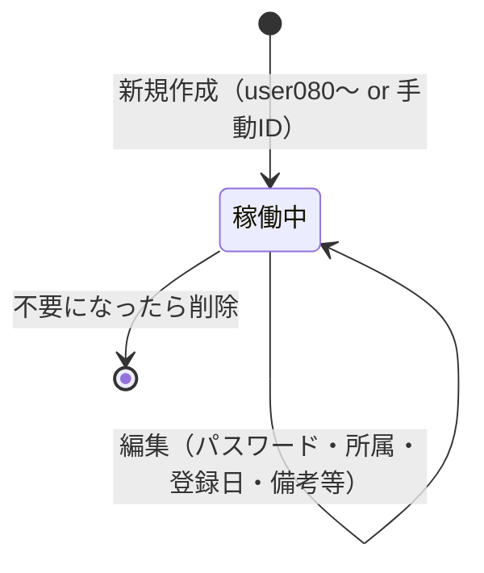

# VPN アカウント管理 — kintone 仕様書（SPEC）

> **起票**: 2026-06-16 (火)  
> **状態**: **v1 完成 — CLOSED**（2026-06-17）／ **v1.1 3ドメイン統合 — SPEC 確定・実装 GO 待ち**（2026-06-20 浜田 Q&A）  
> **完成報告**: `docs/reports/2026-06-17-vpn-account-completion.md`  
> **配置**: [Space 48](https://jbis-kintone.cybozu.com/k/#/space/48) / thread **52**  
> **App ID**: **733**（DB）/ **734**（台帳）  
> **移行元 Excel**: `C:\tmp\VPNアカウント管理\VPNアカウント管理.xlsx`（シート **アカウント一覧** のみ）  
> **UI 参照**: [Apple ID 管理台帳 694](https://jbis-kintone.cybozu.com/k/694/) 型（一覧表 + REST で DB 書込）

---

## §0. 進め方

1. **浜田 Q&A（Q1–Q24）で項目・運用を確定**（**完了**）。
2. **AI チームでレビュー・意見交換**（**済 — §15**）。
3. 本書を正本として浜田 **確認** → **実装 GO** 指示（`.cursor/rules/creation-timing-ask.mdc`）。
4. AI 実行: kintone アプリ作成 → フィールド deploy → Excel **一括移行（66 件）** → ダッシュ customize → 印刷 → 浜田 **目視 OK** → **kintone のみ正本運用**（Excel 削除は §9.4）。

**技術方針**（Apple ID 693/694・Wi-Fi 718/719・ソフトウェア 714/715 と同型）:

| 構成 | 役割 |
|------|------|
| **データアプリ（DB）** | 1 VPN アカウント = 1 レコードの正本 |
| **ダッシュアプリ（台帳）** | Excel 風一覧・新規・編集・削除・印刷 |
| **有償プラグイン** | **NG**（標準フィールド + customize のみ） |
| **DB 標準 UI** | 保存・削除 **全面禁止**（693/714 型 customize。閲覧のみ） |
| **操作入り口** | **台帳（ダッシュ）のみ** |

---

## §1. 背景・目的

### 1.1 背景

- 社内 VPN（`@kensetsutoso.fre`）アカウントを **Excel**（`アカウント一覧` シート）で管理している。
- 現在 **約 66 アカウント**（user 番号型 63 件 + 手動 ID 型 3 件）。
- 利用者への接続情報は **印刷して手渡し**している。

### 1.2 目的

1. Excel と同等の台帳を kintone に置き、**日常操作はダッシュ**で行う。
2. **新規 VPN ID 採番**（起点 **`user080@kensetsutoso.fre`**）と **パスワード自動生成**で手入力ミスを防ぐ。
3. **拠点（所属）単位のライセンス集計**（550 円/口）をダッシュ上部に **アコーディオン**で表示（通常は閉じた状態）。
4. **利用者印刷**をダッシュから出力（A4・大きめ文字）。

### 1.3 スコープ外（v1）

| 項目 | 理由 |
|------|------|
| **廃止ステータス・履歴保持** | 不要アカウントは **削除**。退職等も削除運用（浜田確定） |
| **VPN ID の削除後再利用** | **禁止**（浜田確定） |
| **パスワード再生成ボタン** | 編集画面で手動変更のみ（浜田確定） |
| **管理者向け一覧印刷** | 利用者渡し用のみ（浜田確定） |
| **パスワードマスキング** | IT 管理者専用アプリのため **平文表示**（Excel 同様） |
| **他台帳（PC 674 等）との自動連携** | v1 は独立台帳 |

---

## §2. 用語

| 用語 | 意味 |
|------|------|
| **データアプリ（DB）** | 正本（名称: **VPNアカウント管理台帳用DB（@kensetsutoso.fre）**） |
| **ダッシュアプリ（台帳）** | 日常 UI（名称: **VPNアカウント管理台帳（@kensetsutoso.fre）**） |
| **アカウント名** | 利用者表示名（通常 `姓　名`。例外: `本社共有` 等） |
| **所属** | 拠点・部署名（ドロップダウン **34 選択肢** — §7.3） |
| **VPN ID** | `vpn_id` — ログイン ID（`user###@kensetsutoso.fre` または手動 ID） |
| **採番カウンタ** | `next_user_num` — 次に付与する user 番号（設定レコードで保持） |

---

## §3. アプリ構成

```
Space 48
├── VPNアカウント管理台帳用DB（@kensetsutoso.fre） … 正本・API 書込先
└── VPNアカウント管理台帳（@kensetsutoso.fre） … customize 一覧・操作 UI
```

| 役割 | 参照例 | 本案件（名称・確定） |
|------|--------|----------------------|
| データ | 693 / 714 | **VPNアカウント管理台帳用DB（@kensetsutoso.fre）** |
| ダッシュ | 694 / 715 | **VPNアカウント管理台帳（@kensetsutoso.fre）** |

**App ID**: **733**（DB）/ **734**（台帳） — `kintone-apps.md` / `scripts/data/vpn-account-app-ids.json`

**書込経路（Apple ID 案 B 型）**:

- **新規・編集・削除** → **すべてダッシュから REST API のみ**。
- **DB** の kintone 標準 UI からの **保存・削除は全面禁止**（693/714 型 customize）。
- DB は **閲覧・目視確認**のみ可。
- **初回移行** → Node スクリプト + REST（一括 POST）。

---

## §4. ライフサイクルと運用

### 4.1 操作フロー



| 操作 | 実行者 | 内容 |
|------|--------|------|
| **新規作成** | 管理者 | VPN ID（自動 or 手動）・パスワード自動・登録日=当日・所属・アカウント名 |
| **編集** | 管理者 | アカウント名・所属・パスワード（手動）・登録日・備考。**VPN ID は変更不可** |
| **削除** | 管理者 | 不要アカウントを REST DELETE（確認ダイアログ必須） |
| **印刷** | 管理者 | 選択行を利用者渡し用レイアウトで `window.print()` |

### 4.2 運用ルール（浜田確定）

| 状況 | 操作 | 備考 |
|------|------|------|
| **新規利用者** | ダッシュで **新規作成** | DB 画面では不可 |
| **所属変更・パスワード変更** | ダッシュで **編集** | パスワード再生成ボタンは **なし** |
| **退職・利用停止** | ダッシュで **削除** | **廃止ステータスは持たない** |
| **VPN ID の入力ミス** | **削除 → 新規作成** | 作成後の `vpn_id` は **読取専用** |
| **削除済み ID の再利用** | **禁止** | 採番カウンタは削除で戻さない（§6） |

**削除確認ダイアログ**（ダッシュ）:

- VPN ID・アカウント名・所属を表示。
- 「削除後、この VPN ID は **再利用できません**」を明記。
- VPN 接続中の利用者がいる可能性がある旨を **注意文**として表示（運用上、削除前に口頭確認を推奨）。

---

## §5. 採番ルール（確定）

### 5.1 通常採番（user 番号型）

| 項目 | 内容 |
|------|------|
| **形式** | `user{3桁ゼロ埋め}@kensetsutoso.fre` — 例: `user080@kensetsutoso.fre` |
| **起点** | **`user080`**（Excel 最大 `user070` だが **080 から新規開始** — 浜田確定） |
| **アルゴリズム** | 設定レコードの `next_user_num` を付与 → **+1**（削除では **減らさない**） |
| **一意性** | `vpn_id` フィールド **unique: true** |
| **削除後** | 当該番号は **二度と自動採番されない** |

**移行時の `next_user_num` 初期値**: **`80`**（移行スクリプトまたは手動で設定レコード投入）。

### 5.2 手動 ID（例外採番）

| 項目 | 内容 |
|------|------|
| **用途** | JR システム用等（既存: `akita001` / `morioka001` / `sendai001`） |
| **UI** | 新規作成モーダルにチェックボックス **「IDを手動で指定」** |
| **形式** | `^[a-z0-9]{3,20}@kensetsutoso\.fre$`（**半角英小文字・数字のみ**、ドメイン固定） |
| **バリデーション** | 保存前に **重複チェック**（既存 `vpn_id` と一致不可） |
| **採番カウンタ** | 手動 ID は **`next_user_num` に影響しない** |
| **作成後** | **読取専用**（修正は削除＋新規） |

### 5.3 設定レコード（DB 内・1 件）

| フィールド | 型 | 用途 |
|------------|-----|------|
| `record_kind` | 文字列(1行) | 固定値 **`設定`**（通常アカウント行と区別） |
| `next_user_num` | 数値 | 次の user 番号（初期 **80**） |

- 一覧・移行対象から **除外**（`record_kind != 設定` でフィルタ）。
- ダッシュの採番 API が **GET → 計算 → PATCH** で更新。

---

## §6. パスワード・登録日

### 6.1 パスワード

| タイミング | ルール |
|------------|--------|
| **新規作成** | 自動生成: **`jbis` + 5 桁乱数**（例: `jbis48291`） |
| **編集** | **手動入力可**（空不可）。再生成ボタン **なし** |
| **移行** | Excel 値を **そのまま**投入 |
| **表示** | ダッシュ **平文**（クリックでコピー可 — 694 型） |

**バリデーション（soft）**: 8 文字未満のとき警告表示（保存は許可 — 移行データ・既存運用を阻害しない）。

### 6.2 登録日（`registered_date`）

| タイミング | ルール |
|------------|--------|
| **新規作成** | **当日（JST）** を自動セット |
| **移行** | Excel **登録日** をそのまま |
| **編集** | **変更可** |
| **制約（soft）** | **未来日付**は警告（保存は許可） |

**一覧の既定ソート**: **`registered_date` 降順**（新しい順）。

---

## §7. データアプリ — フィールド定義

### 7.1 アカウントレコード（通常行）

| # | ラベル | コード | 型 | 必須 | unique | 備考 |
|---|--------|--------|-----|------|--------|------|
| 1 | アカウント名 | `account_label` | 文字列(1行) | ○ | — | §7.2 |
| 2 | 所属 | `dept` | ドロップダウン | ○ | — | §7.3（26 選択肢） |
| 3 | VPN ID | `vpn_id` | 文字列(1行) | ○ | ○ | 作成後変更不可 |
| 4 | パスワード | `password` | 文字列(1行) | ○ | — | §6.1 |
| 5 | 登録日 | `registered_date` | 日付 | ○ | — | §6.2 |
| 6 | 備考 | `note` | 文字列(複数行) | — | — | 管理者メモ。**印刷に含めない** |

**採用しないフィールド**: 管理番号（`legacy_no`）、ステータス（廃止/利用中）、マスキング用補助フィールド。

### 7.2 アカウント名（`account_label`）

- **正**: `姓` + **全角スペース（U+3000）** + `名` — 例: `山田　太郎`
- **例外を許容**: `本社共有`、`JRシステム用（秋田）` 等（Excel 実データどおり）
- **入力 UX**: 1 テキストボックス。全角スペース未含有時は **soft 警告**（強制しない）

### 7.3 所属ドロップダウン（34 選択肢・確定）

正本: `scripts/data/vpn-account-depts.json`（DB フィールド・ダッシュ UI で共用）。更新: `npm run vpn-account:update-dept-field`

```
役員室
総務部
経理部
経営企画部
システム推進室
人事研修部
安全推進部
施工推進部
メンテナンス技術部
塗装技術部
品質管理部
東北支店
秋田営業所
盛岡営業所
仙台営業所
関越支店
関越支店施工部
新潟営業所
長野営業所
高崎営業所
東京支店
東京支店施工部
東京支店橋りょうリペア部
千葉営業所
水戸営業所
鎌ヶ谷事務所
東海支店
東京営業所
静岡営業所
名古屋営業所
関西営業所
札幌支店
鉄構支店
湾岸工事所
```

**移行データ**: Excel 移行時は上記のうち **26 所属**のみ使用。残り 8 件は将来の新規所属用。

**新所属の追加**: `vpn-account-depts.json` 更新 → `npm run vpn-account:update-dept-field` → ダッシュ `DEPT_ORDER` 同期 → deploy **734**。

### 7.4 DB customize（693/714 型）

- レコード追加・編集・削除 UI を **ブロック**（`event.error`）。
- **設定レコード**（`record_kind=設定`）も標準 UI からの編集はブロック（ダッシュ API のみ）。

---

## §8. ダッシュアプリ — UI 要件

### 8.1 画面構成

| 領域 | 内容 |
|------|------|
| **ツールバー** | **再読み込み**・**新規作成**・検索欄・**クリア**ボタン |
| **次 ID バナー** | `次の VPN ID: user080@kensetsutoso.fre`（`next_user_num` から算出） |
| **ライセンス集計** | §8.2 — **アコーディオン**（初期 **閉**）。合計 + 所属別内訳 |
| **検索** | テキスト — **アカウント名 / VPN ID / 所属 / 備考** を部分一致。**クリア**で全件表示に戻す |
| **表** | §8.3 の列（**15px 基準**の大きめ文字 — 721 型） |
| **行操作** | **編集** / **削除** / **印刷** |

**画面に BUILD 文字列は表示しない**（deploy 追跡用 `var BUILD` のみコード内保持）。

### 8.2 拠点単位ライセンス集計

| 項目 | ルール |
|------|--------|
| **単価** | **550 円 / 口**（固定） |
| **集計対象** | 全アカウント行（`record_kind != 設定`） |
| **合計** | 口数合計・金額合計（口数 × 550） |
| **内訳** | **所属 34 件すべて**を固定順で表示（**0 口も `0 口 / 0 円` で表示**） |
| **表示順** | 下表の **固定順**（§7.3 と同一） |
| **UI** | `<details>` アコーディオン — **初期状態は閉じる**。サマリー行に合計口数・合計金額を表示 |

**所属表示順（ライセンス集計・内訳・ドロップダウン共通）**: §7.3 の 34 件と同一。

### 8.3 表の列（左→右）

`registered_date` | `account_label` | `dept` | `vpn_id` | `password`* | `note` | 操作

\* **平文表示**（IT 管理者専用）

### 8.4 モーダル

| モーダル | 項目 |
|----------|------|
| **新規作成** | アカウント名・所属・□**IDを手動で指定**（ON 時のみ VPN ID 入力）・パスワード（自動プレビュー）・登録日（当日・表示） |
| **編集** | アカウント名・所属・VPN ID（**読取専用**）・パスワード・登録日・備考 |
| **削除** | 確認（VPN ID・アカウント名・所属・再利用不可の警告） |

### 8.5 印刷（利用者渡し用のみ）

| 項目 | 内容 |
|------|------|
| **用紙** | **A4 縦** |
| **文字** | **大きめ**（会議室掲示 Wi-Fi 台帳 §8.5 に準ずる思想 — 利用者が読みやすいサイズ） |
| **項目順** | アカウント名 → 所属 → VPN ID → パスワード → 登録日 → **注意書き** |
| **備考** | **印刷しない** |
| **方式** | `window.open` + `document.write` + `window.print()`（694/674 型） |

**注意書き（固定文 — 浜田確認用ドラフト）**:

```
【ご注意】
・本紙はあなた専用の VPN 接続情報です。他の社員に見せたり、
  写真・コピー・チャット等で共有しないでください。
・紛失した場合は直ちにシステム推進室までご連絡ください。
・パスワードは第三者に教えないでください。
```

---

## §9. Excel 移行

### 9.1 移行元

| 項目 | 内容 |
|------|------|
| ファイル | `C:\tmp\VPNアカウント管理\VPNアカウント管理.xlsx` |
| シート | **アカウント一覧** のみ（他シートは削除済み） |
| データ行 | **66 件**（連番列が数値の有効行） |
| 特殊 ID | `akita001` / `morioka001` / `sendai001`（各 1 件） |

### 9.2 列マッピング

| Excel 列 | kintone フィールド | 備考 |
|----------|-------------------|------|
| アカウント名 | `account_label` | そのまま |
| 所属 | `dept` | ドロップダウン値と一致確認 |
| アカウント（VPN ID） | `vpn_id` | `@kensetsutoso.fre` 含む |
| パスワード | `password` | **そのまま**（ログに出さない） |
| 登録日 | `registered_date` | Excel 日付 |

### 9.3 移行ポリシー

| 項目 | ルール |
|------|--------|
| 投入方法 | **一括スクリプト**（GO 後 `scripts/vpn-account-migrate-xlsx.mjs` 等） |
| 設定レコード | 移行後 **`next_user_num = 80`** の設定行を 1 件 POST |
| 検証 | 件数 **66**・`vpn_id` unique・所属 26 種・次 ID バナー **user080** |
| パスワード | スクリプト stdout / ログに **出力禁止** |

### 9.4 Excel 削除（目視 OK 後）

| 対象 | パス | 扱い |
|------|------|------|
| 正本ブック | `C:\tmp\VPNアカウント管理\VPNアカウント管理.xlsx` | **削除** |
| フォルダ | `C:\tmp\VPNアカウント管理\` | 空なら **フォルダごと削除**可 |

**削除前チェック**:

- [ ] kintone レコード数 = **66**（+ 設定 1 件）
- [ ] ダッシュで **新規・編集・削除・印刷・集計** が動作
- [ ] 次 ID バナー = **`user080@kensetsutoso.fre`**
- [ ] 浜田 **目視 GO**

---

## §10. 権限・セキュリティ

| 項目 | 方針 |
|------|------|
| **閲覧・編集** | **システム推進室 / kintone 管理者** のみ（浜田確定） |
| **パスワード表示** | **マスキングなし**（Excel 同様・管理者専用） |
| **監査** | kintone 標準の **作成日時・更新日時・更新者** |
| **印刷物** | 手渡し後の保管は利用者責任 — 運用で周知（§8.5 注意書き） |

---

## §11. 実装フェーズ（GO 後）

| Phase | 内容 | 状態 |
|-------|------|------|
| **P0** | 本 SPEC 確定 | **済** |
| **P1** | DB + 台帳作成・フィールド deploy・**DB save/delete ブロック** | **済**（733/734） |
| **P2** | 設定レコード投入・Excel **66 件移行** | **済** |
| **P3** | ダッシュ（一覧・集計・検索・新規・編集・削除・次 ID バナー） | **済** |
| **P4** | 印刷 | **済** |
| **P5** | 権限・`kintone-apps.md` 追記・浜田目視 | **済** |

**着手前ゲート**: 浜田 **実装 GO** / `npm run cio:pre-implement-gate` / §50-3-8。

---

## §12. 未確定事項

**なし**（v1 完成 — 2026-06-17 浜田目視 OK）

---

## §13. 確定サマリ

| 項目 | 確定値 |
|------|--------|
| DB 名 / App | **VPNアカウント管理台帳用DB** — **733** |
| 台帳名 / App | **VPNアカウント管理台帳** — **734** |
| 配置 | **Space 48** / thread **52** |
| 構成 | **DB + ダッシュ** |
| フィールド数 | **6**（アカウント行）+ 設定レコード |
| 所属 | **34** 選択肢（移行データは 26 所属） |
| 廃止ステータス | **なし**（削除運用） |
| 次の VPN ID | **`user080@kensetsutoso.fre`** |
| パスワード（新規） | **`jbis` + 5 桁乱数** |
| ライセンス単価 | **550 円/口** |
| 移行件数 | **66** |
| 台帳 BUILD（最終） | 734=`2026-06-16-vpn-account-dash-license-all-depts` **rev 12** |
| DB BUILD（最終） | 733=`2026-06-16-vpn-account-db-block-ui-mutations` **rev 5** |
| 状態 | **v1 完成 — CLOSED** |

---

## §14. 実装時チェック（AI チーム向け）

| # | 項目 |
|---|------|
| 1 | §50-3-8（着手前 DeepSeek 盲点 + 突合） |
| 2 | `npm run cio:pre-implement-gate` |
| 3 | deploy 前 `verify:kintone-live-schema -- --app <id>` Warning 0 |
| 4 | DB customize: save/delete ブロック（714 型） |
| 5 | 移行スクリプト: **パスワードをログに出さない** |
| 6 | `next_user_num` 設定レコード — 削除時に **デクリメントしない** |
| 7 | 手動 ID: unique + 正規表現バリデーション |
| 8 | DROP_DOWN クエリは **`in ("...")`** 演算子（715 教訓） |
| 9 | 完了時 checkpoint / handoff / `kintone-apps.md` 更新 |
| 10 | `APP_DB` は `vpn-account-app-ids.json` から bundle 前に同期（`vpn-account:bundle-dash`） |
| 11 | 所属順・0 口表示は `scripts/data/vpn-account-depts.json` と `DEPT_ORDER` を同期 |

**npm スクリプト**:

| コマンド | 用途 |
|----------|------|
| `npm run vpn-account:setup` | DB + 台帳作成 + registry |
| `npm run vpn-account:migrate:xlsx -- --apply` | Excel 移行 |
| `npm run vpn-account:update-dept-field` | 所属 DROP_DOWN 更新（733） |
| `npm run deploy:733` / `deploy:734` | customize deploy |

---

## §15. AI チーム SPEC レビュー（2026-06-16）

**結論: v1 完成 — CLOSED**（2026-06-17 浜田目視 OK）。

### 15.1 DeepSeek 盲点チェック（§50-3-8）と CIO 回答

| # | DeepSeek 指摘 | 区分 | CIO 回答 / SPEC 反映 |
|---|---------------|------|----------------------|
| 1 | 削除時の接続中ユーザー | 運用 | 浜田確定の **削除運用**を維持。§4.2 に確認ダイアログ＋注意文を明記 |
| 2 | 手動 ID 重複・形式 | 推奨→確定 | §5.2 に正規表現・unique チェックを明記 |
| 3 | パスワードポリシー | 推奨→確定 | §6.1 — 新規自動・編集手動。8 文字未満は **soft 警告**のみ |
| 4 | Excel 削除の証跡 | 運用 | Apple ID / Wi-Fi 同型 — §9.4 チェックリスト + 浜田目視 GO |
| 5 | 削除 ID 再利用禁止の実装 | 推奨→確定 | §5.1 **`next_user_num` カウンタ方式**（削除で戻さない） |
| 6 | 登録日編集の影響 | 推奨→確定 | §6.2 — 未来日付 soft 警告。ソートは登録日降順 |
| 7 | 印刷のパスワード漏洩 | 運用 | §8.5 注意書き + §10 運用周知 |
| 8 | 所属増減時の表示順 | 推奨→確定 | §7.3 / §8.2 固定 26 順。追加時はフィールド＋順序リストを手動同期（v1） |
| 9 | DB 書込禁止の実現 | 推奨→確定 | §3 — 714 型 customize（権限だけでは不十分） |
| 10 | 移行パスワード品質 | 推奨 | Excel そのまま移行（浜田確定）。必要なら移行後に admin が個別編集 |

### 15.2 突合サマリ

| 観点 | 判定 | コメント |
|------|------|----------|
| 要件網羅（Q1–Q24） | ✅ | 採番・削除・印刷・集計・権限・移行すべて反映 |
| データモデル | ✅ | 6 フィールド + 設定 1 件。シンプルで 694 型に適合 |
| Excel 実データ整合 | ✅ | 66 件・26 所属・特殊 ID 3 件・max user070 → 次 **080** |
| 694 型パターン | ✅ | 既存 `apple-id-dash` / `wifi-ssid-dash` 流用可 |
| 採番（再利用禁止） | ✅ | `next_user_num` で明確化 — 実装単純 |
| セキュリティ方針 | ✅（意図通り） | 管理者専用・平文 — 浜田 GO 済み方針 |
| ブロッカー | ✅ なし | 実装 GO で着手可 |

### 15.3 実装時の軽微メモ（GO 後に AI が吸収）

1. **所属ドロップダウン**: ダッシュ JS 内の選択肢配列と kintone フィールド定義を **同一ソース**（共有 JSON）にするとズレ防止。
2. **移行元パス**: `C:\tmp\...` は浜田 PC 依存 — スクリプトは **引数 or 環境変数**。
3. **印刷 CSS**: 694 / Wi-Fi §8.5 を参考に **18pt 前後の本文・見出し更大**。
4. **設定レコード**: 移行スクリプトが通常行と混在しないよう `record_kind` フィルタを一覧 API に必須化。

---

## 変更履歴

| 日付 | 内容 |
|------|------|
| 2026-06-16 | 浜田 GO — App 733/734 作成・66 件移行・customize deploy |
| 2026-06-17 | 目視フィードバック反映（アコーディオン・文字拡大・クリア・所属34順・0口全表示・APP_DB 修正） |
| 2026-06-17 | **v1 完成 — CLOSED**（浜田目視 OK） |
| 2026-06-19 | **733 フォーム rev7** — `snapshot_month` / `snapshot_json` 追加（月次ライセンス確定保存）。**734 rev13** — 前回確定とのライセンス比較・月次確定ボタン。Space 48 月末注意書き GHA（`vpn-license-space48-notice.yml`・JST 28日〜翌1日） |
| 2026-06-20 | **v1.1 SPEC 確定** — 3 VPN ドメイン統合（§16）。AI チームレビュー + 浜田 Q&A 反映。**実装は浜田 GO 後** |

---

## §16. v1.1 — 3 VPN ドメイン統合（2026-06-20 浜田 GO 前・SPEC 確定）

**背景**: 社内 VPN は同一サービスだがドメインが **3 種**。v1 は `@kensetsutoso.fre` のみ（66 件投入済）。Excel 正本に **105 件**（fre 66 + ds 35 + bnp 4）。**未投入 39 件**を追加し [734](https://jbis-kintone.cybozu.com/k/734/) を **総合台帳**化する。

**実装 GO**: 浜田が本 §16 確認後に **別途指示**。本節のみ commit 済みの段階では **kintone 書込・deploy 禁止**。

### 16.1 ドメイン定義と所属対応（業務ルール・確定）

| VPN ドメイン | 用途 | 対象所属 |
|--------------|------|----------|
| `@kensetsutoso.fre` | 一般部門 | **首都圏支店・BNP 以外の全部門**（34 所属） |
| `@kensetsutoso.ds.fre` | 首都圏支店専用 | **首都圏支店** のみ |
| `@bnp001` | BNP 専用 | **BNP** のみ |

### 16.2 画面・集計（確定）

| 項目 | 内容 |
|------|------|
| **一覧** | **1 表**・全ドメイン・**ドメイン列**あり |
| **フィルタ** | ドメイン切替（すべて / fre / ds.fre / bnp001） |
| **ライセンス集計** | **1 表・全ドメイン合算**（550 円/口・所属別アコーディオン・0 口も表示）。請求は **1 サービス 1 枚**のためドメイン別請求表は **作らない** |
| **次 ID バナー（B1）** | フィルタ **すべて** 時は **3 行**（fre / ds / bnp 各次 ID）。1 ドメイン選択時は **その 1 行のみ** |

### 16.3 新規作成フロー（確定）

1. **アカウント名**入力  
2. **所属**選択  
3. **ドメイン自動セット**（表示・原則変更不可）— §16.1 の対応表  
4. VPN ID（自動 or 手動）・PW・登録日 等  

- フィルタでドメイン絞込時 → **所属候補もそのドメインに合うものだけ**  
- **保存時検証**: 所属とドメインが不一致なら **保存不可**。メッセージ固定:  
  **「所属または指定しているドメインが違いますので確認してください」**  
- **編集**: VPN ID は v1 同様 **読取専用**。所属変更でドメイン整合が取れない場合は **保存不可**（削除→新規）  

### 16.4 パスワード（全ドメイン共通・確定）

| タイミング | ルール |
|------------|--------|
| **新規** | **`jbis` + 5 桁乱数**（v1 §6.1 延長） |
| **編集** | 手入力のみ（再生成ボタンなし） |
| **移行** | Excel 値 **そのまま**（`1541KT…` / `bnp20250…` 等は変更しない） |

### 16.5 自動採番（ドメイン別・確定）

| ドメイン | 形式 | 次の起点 | 手動 ID |
|----------|------|----------|---------|
| `@kensetsutoso.fre` | `user` + **3 桁ゼロ埋め** + ドメイン | **user080**（v1 維持） | ✅ 許可 |
| `@kensetsutoso.ds.fre` | `user` + 番号 + ドメイン | **user36**（Excel `user01`–`user35` の続き） | ✅ 許可 |
| `@bnp001` | `user` + 番号 + `@bnp001` | **user01** | ✅ 許可 |

**番号表記（ds / bnp）**: 1–9 → `user01`…`user09`／10 以上 → `user10`…（Excel 同型）

**手動 ID**: 3 ドメインすべて **チェックボックス「ID を手動で指定」**可。`vpn_id` **全ドメイン横断 unique**。削除後 **再利用禁止**（v1 継承）。

### 16.6 所属ドロップダウン（36 選択肢・確定）

v1 §7.3 の 34 所属に **2 件追加**（挿入位置は浜田指定）:

```
…
札幌支店
首都圏支店     ← 追加（札幌支店の直下）
鉄構支店
湾岸工事所
BNP            ← 追加（湾岸工事所の直下）
```

正本: `scripts/data/vpn-account-depts.json` → `npm run vpn-account:update-dept-field` → 734 `DEPT_ORDER` 同期。

### 16.7 データモデル変更（733）

| 変更 | 内容 |
|------|------|
| **新フィールド** | `vpn_domain` — ドロップダウン 3 値 |
| **設定レコード** | **3 件**（ドメイン別 `next_user_num`）。識別は `record_kind=設定` + `vpn_domain` |
| **既存 66 件** | PATCH で `vpn_domain=@kensetsutoso.fre` |
| **新規移行** | ds **35 件** + bnp **4 件**（Excel 列 **ドメイン** 対応。`npm run vpn-account:migrate:xlsx` 拡張） |
| **月次スナップショット** | **合算 1 本**（ドメイン非依存の内部 ID に正規化） |

### 16.8 利用者印刷（P1・確定）

- **VPN ID 全文**を印刷（例: `user080@kensetsutoso.fre`）。ドメイン行の分割表示は **不要**  
- v1 §8.5 レイアウト・注意書きを **維持**（PW 平文・管理者専用の前提不变）

### 16.9 AI チームレビュー（2026-06-20）

| 論点 | 結論 |
|------|------|
| 550 円/口合算 | 浜田指示どおり。過去契約単価差の会計処理は kintone **スコープ外** |
| 設定 3 件化・`vpn_domain` | 実装で吸収 |
| `vpn_id` unique | 全ドメイン横断（v1 継承） |
| アプリ表示名の `@kensetsutoso.fre` | **v1.1 では変更しない**（実装時に任意。浜田 GO 後） |

### 16.10 実装チェックリスト（GO 後）

1. 733 — `vpn_domain` フィールド deploy + 所属 36 件更新  
2. 既存 66 件 — `vpn_domain` バックフィル  
3. 設定レコード — ds（next=36）・bnp（next=1）追加  
4. migrate — ds 35 + bnp 4  
5. 734 customize — フィルタ・3 行バナー・所属→ドメイン連動・検証・合算集計  
6. `deploy:733` / `deploy:734`（preflight ゲート）  
7. 浜田 **目視 OK** → checkpoint / handoff 更新  
