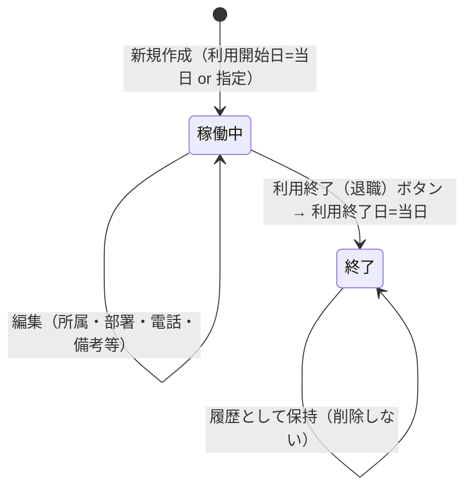

# JREクラウド アカウント管理 — kintone 仕様書（SPEC）

> **起票**: 2026-06-26 (金)  
> **状態**: **浜田 Q&A 確定 — 実装 GO 待ち**  
> **配置**: [Space 34 — JRシステム関連](https://jbis-kintone.cybozu.com/k/#/space/34) / thread **新規**（名称: **JREクラウドアカウント** — 作成時に番号確定）  
> **App ID**: **未割当**（実装時に `scripts/data/jre-cloud-account-app-ids.json` へ記録）  
> **移行元 Excel**: `C:\tmp\JREクラウドアカウント一覧\JREクラウドアカウント一覧.xlsx`（シート **`JREｸﾗｳﾄﾞ全社user` のみ**）  
> **UI 参照**: [VPNアカウント台帳 734](https://jbis-kintone.cybozu.com/k/734/) 型（DB + ダッシュ・REST CRUD・集計・xlsx/印刷）

---

## §0. 進め方

1. **浜田 Q&A（Q1–Q10）で項目・運用を確定**（**完了 — §16**）。
2. **AI チームでレビュー・意見交換**（**済 — §17**）。
3. 本書を正本として浜田 **確認** → **実装 GO** 指示。
4. AI 実行: kintone アプリ作成 → フィールド deploy → Excel **一括移行（99 件）** → ダッシュ customize → 集計・出力 → 浜田 **目視 OK** → **kintone のみ正本運用**（Excel 削除）。

**技術方針**（VPN 733/734・JR iPad 720/721 と同型）:

| 構成 | 役割 |
|------|------|
| **データアプリ（DB）** | 1 JREクラウドアカウント = 1 レコードの正本 |
| **ダッシュアプリ（台帳）** | Excel 風一覧・新規・編集・退職処理・集計・出力 |
| **有償プラグイン** | **NG**（標準フィールド + customize のみ） |
| **DB 標準 UI** | 保存・削除 **全面禁止**（733 型 customize）。**閲覧も IT 管理者のみ** |
| **操作入り口** | **台帳（ダッシュ）のみ** |

---

## §1. 背景・目的

### 1.1 背景

- JREクラウドのユーザアカウントを **Excel**（`JREｸﾗｳﾄﾞ全社user` シート）で管理している。
- 現在 **99 アカウント**（すべてステータス「有効」）。
- 支店別シート（東北/関越/東京）は **エクスポート用** であり、正本ではない。

### 1.2 目的

1. Excel と同等の台帳を kintone（Space 34）に置き、**日常操作はダッシュ**で行う。
2. **月次アカウント数量**を **利用開始日ベース**で集計（部署単位・拠点合計）。
3. 期間・拠点・部署で絞り込み、**Excel 出力** と **印刷** をダッシュから実行。

### 1.3 スコープ外（v1）

| 項目 | 理由 |
|------|------|
| 支店別 Excel シートの再現 | 正本は全社シートのみ（浜田確定） |
| JRE 側 API 自動同期 | v1 は手動運用。有効期限・最終ログインは取込対象外 |
| 595 `dept_name` の自動反映 | JRE **部署** は 595 と別体系（§7.4） |
| 月次確定スナップショット（734 型） | v1 は **都度再計算**。必要なら v1.1 で追加 |

---

## §2. 用語

| 用語 | 意味 |
|------|------|
| **データアプリ（DB）** | 正本（名称: **JREクラウドアカウント管理台帳用DB**） |
| **ダッシュアプリ（台帳）** | 日常 UI（名称: **JREクラウドアカウント台帳**） |
| **ユーザID** | JRE ログイン ID（`xxx@j-bis.co.jp`。Excel 上メールと同一） |
| **所属組織** | **拠点**（本社 / 各支店 / 湾岸工事所 — 5 種） |
| **部署** | JRE 請求・集計用の **部門区分**（18 種 — §7.4） |
| **利用開始日** | アカウント課金開始の基準日 |
| **利用終了日** | 退職・無効化日。空 = **稼働中** |

---

## §3. アプリ構成

```
Space 34
├── JREクラウドアカウント管理台帳用DB … 正本・API 書込先
└── JREクラウドアカウント台帳 … customize 一覧・操作 UI
```

| 役割 | 参照例 | 本案件 |
|------|--------|--------|
| データ | 733 / 720 | **JREクラウドアカウント管理台帳用DB** |
| ダッシュ | 734 / 721 | **JREクラウドアカウント台帳** |

**書込経路**:

- **新規・編集・退職（利用終了日設定）** → **すべてダッシュから REST API のみ**。
- **DB** の kintone 標準 UI からの **保存・削除は全面禁止**。
- **初回移行** → Node スクリプト + REST（一括 POST）。

---

## §4. ライフサイクルと運用

### 4.1 状態



| 操作 | 実行者 | 内容 |
|------|--------|------|
| **新規作成** | IT 管理者 | 595 検索 → 氏名・メール・ID 自動。所属組織（推定可）・**部署手選必須** |
| **編集** | IT 管理者 | ユーザ名・所属組織・部署・電話・利用開始日・備考。**ユーザID は変更不可** |
| **退職・無効** | IT 管理者 | **「利用終了（退職）」** ボタン → 確認 → **利用終了日 = 当日** |
| **削除** | — | **v1 では物理削除しない**（利用終了日で終了扱い） |

### 4.2 一覧フィルタ（バッジ）

| バッジ | 表示対象 |
|--------|----------|
| **稼働中**（既定） | 利用終了日 **空** |
| **すべて** | 全レコード |
| **退職・無効** | 利用終了日 **あり**（「終了」バッジ表示） |

---

## §5. 月次集計

### 5.1 定義（浜田確定）

**月末時点の稼働数** — 集計月の末日を `M` とする。

```
カウント対象 =
  利用開始日 ≦ M
  かつ（利用終了日が空 または 利用終了日 > M）
```

例: 6/15 退職（利用終了日=6/15）→ **5月集計に含む**、**6月集計に含まない**。

### 5.2 レイアウト

- **行**: 部署（18 種 + `－`）
- **拠点小計**: 所属組織ごと
- **最終行**: 全社合計
- **列**: 指定期間内の各月（YYYY-MM）

### 5.3 絞り込み

| 項目 | UI |
|------|-----|
| 期間 | **YYYY-MM ～ YYYY-MM**（1 か月 / 複数月） |
| 拠点 | **multi-select**（734 所属型） |
| 部署 | **multi-select** |

### 5.4 出力

- **xlsx ダウンロード**
- **`window.print()` 印刷**
- 絞込条件は画面と同期

---

## §6. 一覧出力（Excel / 印刷）

**含める項目（1〜8 — 浜田確定）**:

| # | 項目 | フィールド code（案） |
|---|------|---------------------|
| 1 | ユーザID | `user_id` |
| 2 | ユーザ名 | `user_name` |
| 3 | 所属組織 | `org` |
| 4 | 部署 | `dept` |
| 5 | 電話番号 | `phone` |
| 6 | メールアドレス | `mail` |
| 7 | 利用開始日 | `start_date` |
| 8 | 利用終了日 | `end_date` |

**含めない**: 備考（画面・DB には保持）

---

## §7. フィールド定義（DB = 台帳 REST 先）

### 7.1 レコードフィールド

| # | ラベル | code | 型 | 必須 | 備考 |
|---|--------|------|-----|------|------|
| 1 | ユーザID | `user_id` | 文字列（1行） | ○ | **unique**。新規後変更不可 |
| 2 | ユーザ名 | `user_name` | 文字列（1行） | ○ | 全角スペース区切り |
| 3 | 所属組織 | `org` | ドロップダウン | ○ | §7.3 |
| 4 | 部署 | `dept` | ドロップダウン | ○ | §7.4 |
| 5 | 電話番号 | `phone` | 文字列（1行） | — | |
| 6 | メールアドレス | `mail` | 文字列（1行） | ○ | 通常 `user_id` と同一 |
| 7 | 利用開始日 | `start_date` | 日付 | ○ | 新規既定=当日 |
| 8 | 利用終了日 | `end_date` | 日付 | — | 空=稼働中 |
| 9 | 備考 | `note` | 文字列（複数行） | — | Excel K/L メモ移行用 |

### 7.2 バリデーション（ダッシュ）

- `user_id` / `mail`: メール形式 `@j-bis.co.jp`
- `end_date` 入力時: `end_date >= start_date`
- `user_id` 重複 POST 禁止

### 7.3 所属組織（5 種）

正本: `scripts/data/jre-cloud-account-orgs.json`

表示順: 本社 → 東京支店 → 東北支店 → 関越支店 → 湾岸工事所

### 7.4 部署（18 種）

正本: `scripts/data/jre-cloud-account-depts.json`

Excel 全社 99 件から抽出。595 `dept_name` とは **別マスタ**。

### 7.5 595 連携（ハイブリッド — 浜田確定）

| 項目 | 595 から |
|------|----------|
| ユーザ名 | ○ `user_name` |
| メール / ユーザID | ○ `mail` |
| 所属組織 | △ `group_name` → マッピング（`scripts/data/jre-cloud-account-group595-to-org.json`）。未マッチは手選 |
| 部署 | **× 自動しない** — JRE 専用ドロップダウンで **手選必須** |

UI ヒント: 「部署は JREクラウド請求用です。595 の所属とは異なります。」

---

## §8. ダッシュ UI（734 型）

| 機能 | 内容 |
|------|------|
| **一覧** | Excel 風テーブル・キーワード検索（ID/氏名/部署/備考） |
| **フィルタバッジ** | 稼働中 / すべて / 退職・無効 |
| **新規・編集** | モーダル。595 検索ボタン |
| **退職** | 「利用終了（退職）」ボタン |
| **集計** | アコーディオン（初期 **閉**）。§5 |
| **出力** | 一覧 xlsx/印刷、集計 xlsx/印刷 |

---

## §9. 移行

### 9.1 対象

- シート: **`JREｸﾗｳﾄﾞ全社user`**
- 件数: **99**
- 列マッピング: ステータス列は移行しない（利用終了日空 = 有効）。更新日時は kintone システムに任せる

### 9.2 手順

1. `npm run jre-cloud-account:import-excel`（実装時追加）
2. 件数・所属・部署・開始日を検証
3. 浜田目視 OK
4. Excel ファイル削除（浜田判断）

---

## §10. ACL

| アプリ | 権限 |
|--------|------|
| **DB** | IT 管理者のみ閲覧。一般ユーザー **非表示** |
| **台帳** | IT 管理者: レコード閲覧・追加・編集。一般ユーザー **非表示**（VPN 734 同型） |

---

## §11. 実装タスク（GO 後）

| Phase | 内容 |
|-------|------|
| P0 | DB/台帳アプリ作成（Space 34）、フィールド deploy、DB save/delete ブロック |
| P1 | ダッシュ customize（CRUD・595・フィルタバッジ） |
| P2 | 月次集計 + xlsx/印刷 |
| P3 | Excel 99 件移行・目視 OK |

---

## §12. npm スクリプト（実装時追加）

| コマンド | 用途 |
|----------|------|
| `npm run jre-cloud-account:create-apps` | DB + 台帳作成 |
| `npm run jre-cloud-account:deploy-fields` | フィールド反映 |
| `npm run jre-cloud-account:import-excel` | 初回移行 |
| `npm run deploy:<DB_ID>` / `deploy:<DASH_ID>` | customize deploy |

---

## §13. AI チームレビュー（§17 要約）

| 論点 | 結論 |
|------|------|
| 月次集計を kintone 標準集計で | **不可** → 734 同様 **ダッシュ JS で計算** |
| 利用終了日と過去月再計算 | **問題なし**（終了日を保持するため） |
| 595 部署不一致 | **JRE 専用ドロップダウン**で解決（§7.5） |
| 集計の監査固定 | v1 は都度計算。請求確定が必要なら v1.1 で月次スナップショット |
| user_id unique | ダッシュ + import 時チェック |

**ブロッカーなし** — 実装 GO 可能。

---

## §16. 浜田 Q&A 確定一覧

| Q | 内容 | 回答 |
|---|------|------|
| Q1 | 正本データ | **全社user のみ**（99 件） |
| Q2 | 月次集計 | **A 月末稼働数** |
| Q2b | 退職 | → **利用終了日でレコード保持**（後日 Q3 で確定） |
| Q3 | 退職処理 | **利用終了日 = 退職日、削除しない** |
| Q4 | 一覧表示 | 既定 **稼働中**、バッジ **すべて / 退職・無効** |
| Q5 | 集計レイアウト | **部署行 + 拠点小計 + 全社合計**、期間・拠点・部署 multi-select |
| Q6 | 595 連携 | **A' ハイブリッド** — 部署は JRE ドロップダウン手選 |
| Q7 | DB 権限 | **A — 733 同型**（IT のみ・操作は台帳のみ） |
| Q8 | 出力 | 一覧 **1〜8**、集計 xlsx+印刷 **OK** |
| Q9 | アプリ名 | **JREクラウドアカウント管理台帳用DB** / **JREクラウドアカウント台帳** |
| Q10 | 備考・退職ボタン・移行 | **すべて OK** |

---

## §17. 変更履歴

| 日付 | 内容 |
|------|------|
| 2026-06-26 | 初版 — 浜田 Q1–Q10 確定・AI レビュー済 |
