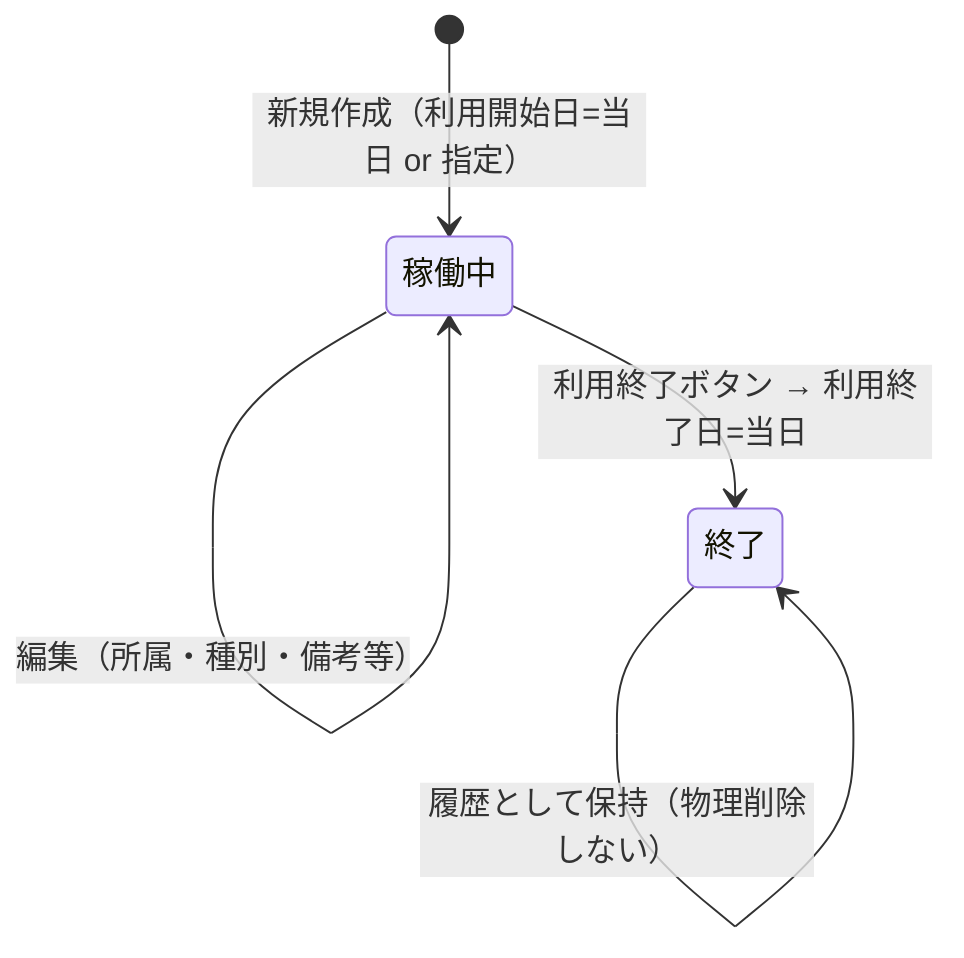

# Kintone アカウント管理 — kintone 仕様書（SPEC）

> **起票**: 2026-07-05 (日)  
> **状態**: **v1.2 実装・deploy 済 — 浜田 UI 調整反映**（2026-07-05）  
> **App ID**: **752**（DB）/ **753**（台帳）— `scripts/data/kintone-account-app-ids.json`  
> **最終 BUILD**: DB `2026-07-05-kintone-account-db-block-v1` rev5 / 台帳 `2026-07-05-kintone-account-dash-v19-agg-100rem-list-sort` rev22  
> **移行元 Excel**: `C:\tmp\kintoneアカウント台帳\Kintoneアカウント一覧.xlsx`（明細 **行14ヘッダ以降**）  
> **UI 参照**: [JREクラウドアカウント台帳 745](https://jbis-kintone.cybozu.com/k/745/) 型（745型ライフサイクル・集計）+ [VPNアカウント台帳 734](https://jbis-kintone.cybozu.com/k/734/) 型（DB+台帳・REST CRUD）

---

## §0. 進め方

1. **浜田 Q&A（§41 Q1–Q4）で項目・運用を確定**（**完了**）。
2. **AI チームでレビュー・意見交換**（**済 — §15**）。
3. 本書を正本として浜田 **確認** → **実装 GO** 指示。
4. AI 実行: kintone アプリ作成 → フィールド deploy → Excel **74 件移行** → ダッシュ customize → 集計・出力 → 浜田 **目視 OK** → **kintone のみ正本運用**（Excel 削除は浜田判断）。

**技術方針**（VPN 733/734・JRE 744/745 と同型）:

| 構成 | 役割 |
|------|------|
| **データアプリ（DB）** | 1 Kintone アカウント = 1 レコードの正本 |
| **ダッシュアプリ（台帳）** | Excel 風一覧・新規・編集・利用終了・集計・出力 |
| **有償プラグイン** | **NG**（標準フィールド + customize のみ） |
| **DB 標準 UI** | **保存・削除 全面禁止**（733/744 型 customize）。**閲覧のみ**（IT 管理者） |
| **操作入り口** | **台帳（ダッシュ）のみ** |

---

## §1. 背景・目的

### 1.1 背景

- 社内 **Kintone ライセンス ID**（ログイン ID）を **Excel**（`Kintoneアカウント一覧.xlsx`）で管理している。
- 現在 **74 アカウント**（すべてステータス「使用中」）。
- 契約 **77 ID**・余剰 **3**・単価 **1,800 円/ID/月**（Excel サマリー行より）。
- 支払箇所: **本社** / **首都圏支店**。

### 1.2 目的

1. Excel と同等の台帳を kintone（**Space 48**）に置き、**日常操作はダッシュ**で行う。
2. **アカウント集計**（所属グループ × 所属）を **現時点の稼働数** で表示（**所属グループ単位小計** — §5.1）。
3. **月次利用費用**を **支払箇所 × 月次（月末稼働）** で集計（§5.2）。
4. **契約数・月額サマリー**はダッシュ上部で **参照表示**（編集は §5.2.1 の月別設定のみ）。
5. **一覧 xlsx 出力** と **印刷** をダッシュから実行。

### 1.3 スコープ外（v1）

| 項目 | 理由 |
|------|------|
| kintone サイボウズ側 API 自動同期 | v1 は手動運用 |
| 月次確定スナップショット（734 型） | 745型終了日保持で再計算可能。必要なら v1.1 |
| 一般ユーザー向け閲覧 | **admin（IT 管理者）のみ**（浜田確定） |
| Space 48 ポータルリンク自動設置 | **浜田手動**（浜田確定） |
| 595 からの所属自動反映 | Kintone 台帳の所属は **680/§7.4 マスタ**（595 とは別体系） |

---

## §2. 用語

| 用語 | 意味 |
|------|------|
| **データアプリ（DB）** | 正本（名称: **Kintoneアカウント管理台帳DB**） |
| **ダッシュアプリ（台帳）** | 日常 UI（名称: **Kintoneアカウント管理台帳**） |
| **支払箇所** | 請求先区分（**本社** / **首都圏支店**）— **月次費用集計専用軸** |
| **アカウント種別** | 特権 / 本社共有 / 本社個人 / 首都圏支店個人 |
| **所属グループ** | 集計・組織軸（9 種 — §7.3）。Excel **部署グループ** に相当 |
| **所属** | 所属グループ配下の部門・支店・営業所（§7.4）。Excel **部署** に相当 |
| **ログインID** | Kintone ログイン ID（短形式。例: `horigome`）— **unique** |
| **利用開始日** | アカウント課金・**登録日**の基準日（§41 Q2） |
| **利用終了日** | 利用終了日。空 = **稼働中**（745 型） |

---

## §3. アプリ構成

```
Space 48
├── Kintoneアカウント管理台帳DB … 正本・API 書込先（閲覧のみ）
└── Kintoneアカウント管理台帳 … customize 一覧・操作 UI
```

| 役割 | 参照例 | 本案件（名称・浜田確定） |
|------|--------|------------------------|
| データ | 733 / 744 | **Kintoneアカウント管理台帳DB** |
| ダッシュ | 734 / 745 | **Kintoneアカウント管理台帳** |

**書込経路**:

- **新規・編集・利用終了（終了日設定）** → **すべてダッシュから REST API のみ**。
- **DB** の kintone 標準 UI からの **保存・削除は全面禁止**（**誰も触れない — 見るだけ**）。
- **初回移行** → Node スクリプト + REST（一括 POST）。

---

## §4. ライフサイクルと運用（745 型）

### 4.1 状態



| 操作 | 実行者 | 内容 |
|------|--------|------|
| **新規作成** | IT 管理者 | 全項目入力。595 検索は **任意**（§7.6） |
| **編集** | IT 管理者 | 表示名・所属・アカウント種別・備考等。**ログインID は変更不可** |
| **利用終了** | IT 管理者 | **「利用終了」** ボタン → 確認 → **利用終了日 = 当日** |
| **物理削除** | — | **v1 では行わない**（月次費用・監査のため） |

### 4.2 一覧フィルタ（バッジ — 745 同型）

| バッジ | 表示対象 |
|--------|----------|
| **稼働中**（既定） | 利用終了日 **空** |
| **すべて** | 全レコード |
| **終了** | 利用終了日 **あり** |

### 4.3 一覧検索・クリア（745 同型）

| 項目 | 内容 |
|------|------|
| **検索** | キーワード入力（§7.7）。スペース区切り **AND** |
| **クリア** | 検索キーワードを空にし、表示を **稼働中** に戻す |

### 4.4 一覧ソート・見出し行（浜田確定 2026-07-05 v1.2）

**見出し行**（紫ライン `kac-list-section-row`）— 所属グループの **始まり** にラベル表示:

| ラベル |
|--------|
| 本社 / 東北支店 / 関越支店 / 東京支店 / 東海支店 |
| **リフォーム事業統括部（本社分）** / **リフォーム事業統括部（首都圏支店分）** |
| 鉄構支店 / 湾岸工事所 / ブリッジニアプラス |

- **リフォーム事業統括部**のみ `pay_site` で **本社分・首都圏支店分** に分割（請求実態に合わせる）
- フィルタで絞った場合、**表示対象の拠点のみ**見出しが付く

**ソート順**（`compareListRows`）:

| 順 | キー |
|----|------|
| 1 | 所属グループ（§7.3 固定順） |
| 2 | リフォームのみ: 支払箇所（本社 → 首都圏支店） |
| 3a | **本社**: 所属（§7.4）→ **アカウント種別**（下表）→ ログインID |
| 3b | **本社以外**: **アカウント種別**（下表）→ 所属 → ログインID |

**アカウント種別の並び**:

| 対象 | 順 |
|------|-----|
| **本社以外** | **特権**（`login_id=admin` または 特権アカウント）→ **個人**（本社個人・首都圏支店個人）→ **共有**（本社共有） |
| **本社** | 部署ごと: **admin（特権）** → **本社個人** → **本社共有** |

> **特権アカウント**は実運用上 **admin のみ**。

---

## §5. 集計

### 5.0 集計共通

**アカウント集計**と**月次利用費用集計**は粒度が異なる（浜田確定 2026-07-05 追記）。

| 集計 | 粒度 | 期間 UI |
|------|------|---------|
| **アカウント集計**（§5.1） | **現時点スナップショット**（列 = **件数** 1 列） | **なし**（所属グループ・所属チップのみ） |
| **月次利用費用**（§5.2） | **月ベース**（745 型。列 = **YYYY-MM**） | YYYY-MM ～ YYYY-MM・**当年通年** |

**月次利用費用 — 期間 UI**:

| 項目 | 内容 |
|------|------|
| 期間 | **YYYY-MM ～ YYYY-MM**（1 か月 / 複数月）。**当年通年**ボタン |
| 更新 | **集計を更新** ボタン（条件変更後に押す） |
| リセット | **条件クリア** — 期間を当年通年 |
| 出力 | xlsx / 印刷（対象月列をそのまま出力） |

**アカウント集計 — 条件 UI**:

| 項目 | 内容 |
|------|------|
| 絞込 | 所属グループ・所属 **チップ toggle** + **条件クリア**（すべて ON に戻す） |
| 更新 | **集計を更新** ボタン |
| 出力 | xlsx / 印刷 |

**稼働判定**:

| 集計 | 判定 |
|------|------|
| **アカウント集計** | **現時点** — `end_date` が空（= 稼働中） |
| **月次利用費用** | **月末スナップショット** — §5.0 旧 745 同型（`start_date` / `end_date` ベース） |

**月末稼働判定**（月次利用費用のみ — `start_date` / `end_date` ベース）:

集計月を `M`、その **末日** を `M_end` とする。

```
M の月末時点で稼働 =
  start_date ≦ M_end
  かつ（end_date が空 または end_date > M_end）
```

例: 6/15 終了（`end_date=2026-06-15`）→ **5月列に含む**、**6月列に含まない**。

### 5.1 アカウント集計（現時点 — 所属グループ × 所属）

**目的**: 所属グループ × 所属 の **現時点稼働数**を **1 列（件数）** で表示。

**レイアウト**:

| 行 | 所属グループ（§7.3 固定順）/ 所属（§7.4） |
|----|------------------------------------------|
| 列 | **件数**（現時点） |
| 小計 | **所属グループごと** |
| 最終行 | **全社合計** |

- **絞込**: 所属グループ・所属 **チップ toggle**（745 同型）+ **条件クリア**
- **表幅**: コンパクト表示 **`max-width: 100rem`**（所属名の折返し抑制）
- **出力**: xlsx / 印刷
- **期間 UI なし**（月次推移は不要 — 浜田確定 2026-07-05）

### 5.2 月次利用費用集計（支払箇所 × 月次）

**目的**: **支払箇所**（本社 / 首都圏支店）別の **月次利用費用**（§5.0 **月末ベース**）。

**件数（各月 M）**:

| 区分 | 算出 |
|------|------|
| **利用分** | `pay_site` 別の **M 月末稼働数**（§5.0 判定） |
| **余剰分**（本社のみ） | `max(0, 総契約数 − M 月末の全社稼働数)`（§5.2.2） |
| **小計** | 本社 = 利用分 + 余剰分 / 首都圏 = 利用分 |

**金額（各月 M）**: 上記 **件数 × 単価**（§5.2.1。コード固定 **禁止**）。

> **v1.1（2026-07-05）**: **月別**に総契約数・月額単価を保持。各月 M の余剰・利用料は **その月の設定値** で算出。

#### 5.2.1 費用集計パラメータ（月別 — 浜田追加要件 2026-07-05 / UI v1.2 確定）

**背景**: Kintone（サイボウズ）の **価格改定が多い** ため、契約数・単価をソースコードや DB フィールド初期値に **固定してはならない**。請求は **月単位** のため、**月ごと**に契約数・単価を入力できること。

**配置**: **月次利用費用集計** アコーディオン内、集計表の直上。

**UI 構成（2 ブロック — 浜田確定 2026-07-05 v1.2）**:

| ブロック | 内容 |
|----------|------|
| **① 契約数・月額の改定（指定月以降）** | **年**（数値）・**月**（1–12 選択）・**以降**・**契約数**・**月額（円）** → **表に反映**（ドラフト更新） |
| **② 表示期間の月別設定** | 表示期間（YYYY-MM ～ YYYY-MM）の **全月を読み取り専用表**で一覧（スクロールなし）。`2026年7月` 形式。**月別設定を保存** で localStorage 確定 |

**操作フロー**:

1. 期間を指定 → **集計を更新**
2. 改定: 例）2026年 **7月** 以降・契約数 80・月額 2000 → **表に反映** → 7月～終了月の行が更新
3. 表示期間 **すべて同じ値**: 期間の **最初の月** を指定して **表に反映**
4. 表を確認 → **月別設定を保存** → 集計再計算

| 項目 | 内容 |
|------|------|
| **保存** | **月別設定を保存** → localStorage `kintone-account-ledger-settings-v2`（`defaults` + `monthly`） |
| **ドラフト** | **表に反映** は画面内ドラフトのみ。**保存** まで localStorage には書かない |
| **一覧サマリー（§5.3）** | **当月**の契約数・月額は **参照表示のみ**（編集 UI なし） |

**各月 M の算出**:

```
余剰数(M) = max(0, 総契約数(M) − M 月末の全社稼働数)
利用料(M) = 件数 × 1アカウント月額(M)
全社請求(M) = 総契約数(M) × 1アカウント月額(M)
```

| 表示（当月） | 内容 |
|------|------|
| アカウント利用数 | **M 月末**稼働数（全社） |
| アカウント余剰数 | **M** の余剰（本社配賦） |
| 月額利用料合計 | **総契約数(M) × 単価(M)** |

#### 5.2.2 支払箇所のくくり（余剰＝本社 — 浜田確定 2026-07-05）

**余剰 ID はすべて本社分としてカウント**する。首都圏支店に余剰は配賃しない。

```
余剰数(M) = max(0, 総契約数(M) − M 月末の全社稼働数)
```

| 支払箇所 | 内訳 | 件数の出所（各月 M） |
|----------|------|----------------------|
| **本社** | **利用分** | `pay_site = 本社` の **M 月末稼働数** |
| **本社** | **余剰分** | **余剰数(M)**（レコードなし・論理行） |
| **本社** | **小計** | 利用分 + 余剰分 |
| **首都圏支店** | **利用分** | `pay_site = 首都圏支店` の **M 月末稼働数** |
| **首都圏支店** | **小計** | 利用分のみ（余剰 **0**） |
| **全社** | **合計** | 本社小計 + 首都圏小計 |

**例（2026-07 月末・移行直後）**: 総契約 77 / 利用 74 / 余剰 3 → 本社 68+3=**71**、首都圏 **6**、合計 **77**。

**月額（サマリー — 当月列と同期）**:

- 本社月額 = **本社小計 × 単価**
- 首都圏月額 = **首都圏利用分 × 単価**
- 全社月額 = **総契約数 × 単価**

**UI 要件**:

- §5.2.1 パネル内、またはその直下に **当月** の支払箇所別内訳（利用分 / 余剰分 / 小計）を表示。
- 月次集計表の **行 × 月列** も同構造（本社・利用分 / 本社・余剰分 / 首都圏・利用分）。
- **余剰分**は DB レコードを持たない。**各月 M** の §5.0 判定 + **総契約数(M)** から算出。

**保存先（v1.1）**: ブラウザ **localStorage**（`kintone-account-ledger-settings-v2`）。将来 kintone 設定レコードへ移行可。

**月次集計表レイアウト**:

| 行（支払箇所） | 区分 | 列 |
|----------------|------|-----|
| 本社 | 利用分 | 各月 **月末稼働数** |
| 本社 | 余剰分 | 各月 **余剰数(M)** |
| 本社 | **小計** | 利用分 + 余剰分 |
| 首都圏支店 | 利用分 | 各月 **月末稼働数** |
| 首都圏支店 | **小計** | 利用分 |
| **全社** | **合計** | 本社小計 + 首都圏小計 |

**金額行**（任意表示）: 各行の件数 × 単価（件数行の下に円行を付ける、または件数/金額を2段表示 — 実装時 745 UI 踏襲）。

**§5.2.1 共通 UI**（入力・保存）:

- 数値入力欄 + **保存** ボタン（または blur 時に設定 REST 保存）。
- 保存後 **「集計を更新」** で月次表を再計算。
- ヒント: 「余剰 ID は **本社** に計上されます。」
- xlsx / 印刷: 単価・総契約数・**支払箇所別内訳（利用/余剰）** をヘッダ注記。

**絞込**: 期間（YYYY-MM ～ YYYY-MM）・支払箇所チップ（745 集計 UI 踏襲）。

> **注**: 過去月の再集計は **745 型（終了日保持）** により整合。確定保存が必要になったら v1.1 で 734 型スナップショットを検討。

### 5.3 一覧上部サマリー（Excel 行2–5 相当）

§5.2.1 と **同一の契約・単価** を、台帳 **一覧画面上部** にコンパクト表示（Excel サマリー相当）。

| 項目 | 内容 |
|------|------|
| 表示 | 1アカウント月額 / 総契約数 / 利用数 / 余剰（本社配賦）/ **本社・首都圏内訳** / 月額合計 |
| 編集 | **不可（参照のみ）** — 契約数・月額の変更は **§5.2.1 月次利用費用集計** の月別設定のみ |
| 配置 | 一覧ヘッダ付近（常時表示） |

> **正本**: 契約数・単価の編集 UI は **月次利用費用集計 §5.2.1** のみ。一覧上部は **当月スナップショットの参照**。

---

## §6. 一覧出力（Excel / 印刷）

**含める項目（Excel 明細列 + 日付）**:

| # | 項目 | フィールド code |
|---|------|-----------------|
| 1 | 支払箇所 | `pay_site` |
| 2 | アカウント種別 | `account_type` |
| 3 | 所属グループ | `org` |
| 4 | 所属 | `dept` |
| 5 | 表示名 | `display_name` |
| 6 | ログイン名 | `login_name` |
| 7 | ログインID | `login_id` |
| 8 | ステータス | `status` |
| 9 | 利用開始日 | `start_date` |
| 10 | 利用終了日 | `end_date` |

**含めない**: 備考（画面・DB には保持）

---

## §7. フィールド定義（DB = 台帳 REST 先）

### 7.1 レコードフィールド

| # | ラベル | code | 型 | 必須 | 備考 |
|---|--------|------|-----|------|------|
| 1 | 支払箇所 | `pay_site` | ドロップダウン | ○ | §7.2 |
| 2 | アカウント種別 | `account_type` | ドロップダウン | ○ | §7.2 |
| 3 | 所属グループ | `org` | ドロップダウン | ○ | §7.3 |
| 4 | 所属 | `dept` | ドロップダウン | ○ | §7.4（org に連動） |
| 5 | 表示名 | `display_name` | 文字列（1行） | ○ | 全角スペース区切り可 |
| 6 | ログイン名 | `login_name` | 文字列（1行） | ○ | |
| 7 | ログインID | `login_id` | 文字列（1行） | ○ | **unique**。新規後変更不可 |
| 8 | ステータス | `status` | ドロップダウン | ○ | 使用中 / 終了（終了日連動） |
| 9 | 利用開始日 | `start_date` | 日付 | ○ | **登録日基準**。新規既定=当日 |
| 10 | 利用終了日 | `end_date` | 日付 | — | 空=稼働中 |
| 11 | 備考 | `note` | 文字列（複数行） | — | |

### 7.2 支払箇所・アカウント種別

**支払箇所**（2 種）: 本社 / 首都圏支店

**アカウント種別**（4 種）: 特権アカウント / 本社共有 / 本社個人 / 首都圏支店個人

| 種別 | 支払箇所（Excel 実績） |
|------|------------------------|
| 特権アカウント | 本社 |
| 本社共有 | 本社 |
| 本社個人 | 本社 |
| 首都圏支店個人 | 首都圏支店 |

新規作成時: 種別選択で **支払箇所を自動セット**（手修正可）。

### 7.3 所属グループ（9 種 — 表示順固定）

正本: `scripts/data/kintone-account-orgs.json`

1. 本社  
2. 東北支店  
3. 関越支店  
4. 東京支店  
5. 東海支店  
6. リフォーム事業統括部  
7. 鉄構支店  
8. 湾岸工事所  
9. ブリッジニアプラス  

### 7.4 所属（所属グループ配下）

正本: `scripts/data/kintone-account-depts-by-org.json`

**本社**: 役員室 / 総務部 / 経理部 / 経営企画部 / 人事研修部 / 安全推進部 / 施工推進部 / メンテナンス技術部 / 塗装技術部 / 品質管理部

**支店・その他**（所属グループごと）:

| 所属グループ | 所属 |
|-------------|------|
| 東北支店 | 東北支店 / 秋田営業所 / 盛岡営業所 / 仙台営業所 |
| 関越支店 | 関越支店 / 新潟営業所 / 長野営業所 / 高崎営業所 |
| 東京支店 | 東京支店 / 千葉営業所 / 水戸営業所 / 鎌ヶ谷事務所 |
| 東海支店 | 東海支店 / 東京営業所 / 静岡営業所 / 名古屋営業所 / 関西営業所 |
| リフォーム事業統括部 | リフォーム事業統括部 / 札幌支店 / 首都圏支店 |
| 鉄構支店 | 鉄構支店 |
| 湾岸工事所 | 湾岸工事所 |
| ブリッジニアプラス | ブリッジニアプラス |

> **680 整合**: 東京支店配下の **千葉・水戸・鎌ヶ谷** は 680 部門マスタに存在するが **現行 Excel 74 件には未使用**。v1 マスタに含め将来登録に備える（§15 論点2）。

### 7.5 バリデーション（ダッシュ）

- `login_id`: **unique**（POST 時チェック）
- `end_date` 入力時: `end_date >= start_date`
- `org` / `dept` の組み合わせ: §7.4 マスタに存在すること
- 利用終了時: `status` → **終了** に更新

### 7.6 595 連携（任意 — ハイブリッド）

| 項目 | 595 から |
|------|----------|
| 表示名 / ログイン名 | ○ `user_name`（個人アカウント向け） |
| 所属グループ / 所属 | △ 680 候補マスタ（App **680**）モーダル。**595 所属とは別体系** |
| 共有 / 特権 | **595 検索スキップ可** — 手入力 |

UI ヒント: 「所属は Kintone 台帳用マスタです。595 の所属とは異なります。」

### 7.7 一覧キーワード検索（745 踏襲）

| 項目 | 内容 |
|------|------|
| **対象** | `login_id` / `display_name` / `login_name` / `org` / `dept` / `pay_site` / `account_type` / `note` |
| **結合 haystack** | `org + dept`（スペース・`/` 等）— DB は分離維持 |
| **AND** | スペース区切りトークン |

---

## §8. ダッシュ UI（745 + 734 型）

| 機能 | 内容 |
|------|------|
| **一覧サマリー** | §5.3 — 契約・単価の **参照表示**（編集なし） |
| **一覧** | Excel 風テーブル・検索・クリア・**§4.4 見出し行・種別ソート** |
| **フィルタバッジ** | 稼働中 / すべて / 終了 |
| **新規・編集** | モーダル。680 所属候補 + 595 任意検索 |
| **利用終了** | 「利用終了」ボタン |
| **アカウント集計** | §5.1 — **現時点稼働数**（件数 1 列・**100rem**）— アコーディオン |
| **月次利用費用** | §5.2 + **§5.2.1 改定パネル + 月別設定表** — **月列** — アコーディオン |
| **出力** | 一覧 xlsx/印刷、各集計 xlsx/印刷（単価・契約数をヘッダ注記） |

---

## §9. 移行

### 9.1 対象

- シート: **先頭シート**（明細ヘッダ行 **14**、データ **15 行目～**）
- 件数: **74**
- **利用開始日**: 全件 **2026-07-05**（§41 Q2 — 移行日統一）
- **利用終了日**: 空（稼働中）

### 9.2 列マッピング（Excel B 列起点 = index 1）

| Excel 列 | フィールド |
|----------|-----------|
| 支払箇所 | `pay_site` |
| アカウント種別 | `account_type` |
| 部署グループ | `org` |
| 部署 | `dept` |
| 表示名 | `display_name` |
| ログイン名 | `login_name` |
| ログインID | `login_id` |
| ステータス | `status` |
| 備考 | `note` |

### 9.3 手順

1. `npm run kintone-account:create-apps`（実装時追加）
2. `npm run kintone-account:deploy-fields`
3. `npm run kintone-account:import-excel`
4. 件数 **74**・支払箇所内訳（本社 68 / 首都圏 6）・所属を検証
5. 浜田目視 OK

---

## §10. ACL

| アプリ | 権限 |
|--------|------|
| **DB** | IT 管理者: **閲覧のみ**。保存・削除 **customize で全面禁止** |
| **台帳** | IT 管理者: レコード閲覧・追加・編集。**一般ユーザー非表示** |
| **一般ユーザー** | **両アプリ非表示**（admin のみ — 浜田確定） |

---

## §11. 実装タスク（GO 後）

| Phase | 内容 |
|-------|------|
| P0 | DB/台帳アプリ作成（Space 48）、フィールド deploy、**DB save/delete ブロック** |
| P1 | ダッシュ customize（CRUD・680/595・フィルタバッジ・サマリー） |
| P2 | アカウント集計 + 月次利用費用 + xlsx/印刷 |
| P3 | Excel 74 件移行・目視 OK |

**customize 配置（予定）**:

- DB: `customize/kintone-account-db/desktop.js`（save/delete ブロック）
- 台帳: `customize/kintone-account-dash/desktop.js`（745 fork ベース）

---

## §12. npm スクリプト（実装時追加）

| コマンド | 用途 |
|----------|------|
| `npm run kintone-account:create-apps` | DB + 台帳作成 |
| `npm run kintone-account:deploy-fields` | フィールド反映 |
| `npm run kintone-account:import-excel` | 初回移行 |
| `npm run deploy:<DB_ID>` / `deploy:<DASH_ID>` | customize deploy |

---

## §13. 浜田 §41 Q&A 確定一覧

| Q | 内容 | 回答 |
|---|------|------|
| Q1 | 集計の種類 | **アカウント**=所属グループ×所属の **現時点稼働数**（§5.1） / **費用**=支払箇所× **月末件数×月列**（§5.2・余剰は本社） |
| Q2 | 登録日 | **利用開始日**=登録日基準。移行 **74 件 = 2026-07-05** |
| Q3 | 終了 | **745 型** — 利用終了日。**物理削除しない** |
| Q4 | 集計軸 | **所属グループ** 9 種固定順 + **所属** マスタ（§7.4）。**所属グループ単位小計** |
| — | Space | **48** |
| — | 権限 | **admin のみ** |
| — | ポータル | **浜田手動** |
| — | 契約・月額 | **月次費用 §5.2.1 で admin 編集**（指定月以降改定 + 月別保存）。一覧上部は参照のみ |
| — | 一覧見出し | **全所属グループ**に紫ライン見出し。リフォームは本社分/首都圏支店分（§4.4） |
| — | 一覧ソート | **種別** 特権→個人→共有（本社は部署→個人→共有）（§4.4） |
| — | 集計粒度 | **アカウント=現時点** / **費用=月ベース**（745 型・月末稼働判定） |
| — | 余剰の配賦 | **余剰分はすべて本社**。首都圏は **利用分のみ**（§5.2.2） |
| — | アプリ名 | **Kintoneアカウント管理台帳** / **Kintoneアカウント管理台帳DB** |
| — | DB 操作 | **見るだけ**（保存・削除禁止・操作は台帳のみ） |

---

## §14. AI チームレビュー（2026-07-05）

### 14.1 結論

**ブロッカーなし — 実装 GO 可能。**

745 型（利用終了日）により、月次利用費用の過去月再計算と矛盾しない。DB 閲覧のみ + 台帳 REST は VPN/JRE 実績どおり。

### 14.2 論点整理

| # | 論点 | 結論 | 備考 |
|---|------|------|------|
| 1 | 物理削除 vs 月次費用 | **745 型で解決** | 終了日保持。再集計 OK |
| 2 | 東京支店の千葉/水戸/鎌ヶ谷 | **マスタに含める** | Excel 74 件未使用。680 整合 |
| 3 | 札幌・首都圏の所属グループ | **リフォーム事業統括部配下** | Excel 実績どおり |
| 4 | 595 連携 | **任意ハイブリッド** | 共有・特権は手入力 |
| 5 | 月次費用の定義 | **月末稼働数 × 単価** | §5.0 月ベース。浜田確定 2026-07-05 |
| 6 | 契約数 77 の保存 | **734 型設定レコード** | 手入力 + 利用数自動 |
| 7 | login_id unique | **必須** | 短 ID（メール形式ではない） |
| 8 | kintone 標準集計 | **不可** | 745 同様 JS 計算 |
| 9 | Space thread ID | **実装時確定** | app-ids.json に記録 |
| 10 | status フィールド | **維持** | Excel 互換 + 終了日連動 |
| 11 | 価格改定 | **集計表直上で単価・契約数編集** | 浜田追加 2026-07-05。734 設定レコード保存 |
| 12 | 余剰の配賦 | **本社に集約** | 本社=利用+余剰 / 首都圏=利用のみ。浜田確定 2026-07-05 |
| 13 | 集計粒度 | **アカウント=現時点 / 費用=月ベース** | アカウント集計は月次不要（浜田追記 2026-07-05）。費用のみ月列 |

### 14.3 実装 GO 後の確認

**なし** — 月次費用の数え方（月末稼働）は §5.0 で確定済み。

---

## §15. 変更履歴

| 日付 | 内容 |
|------|------|
| 2026-07-05 | **v1.2 UI 確定（BUILD v19 rev22）** — 月別設定: 改定パネルのみ + 読取専用12か月表 / サマリー参照のみ / 一覧全拠点見出し / 種別ソート / アカウント集計 100rem |
| 2026-07-05 | **月別契約数・単価** — 利用料集計を月ごとの設定に対応（localStorage v2） |
| 2026-07-05 | **v1 deploy** — 752/753 作成・74 件移行・customize deploy |
| 2026-07-05 | §5.2.1 追加 — 月次費用集計表直上で総契約数・月額単価を admin 編集可（価格改定対応） |
| 2026-07-05 | 初版 — §41 Q1–Q4 確定・AI チームレビュー済・浜田 GO 待ち |
