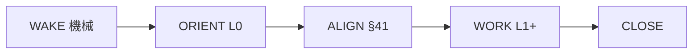

# Session Lifecycle v2 — セッション開始〜完了（正本）

> **正本日**: 2026-06-21 JST — AI チーム運用改善 A（浜田 GO）  
> **上位**: `AGENTS.md` §35-1 / §56-1a（開発=AI・確認=浜田）  
> **詳細 WAKE**: `docs/runbooks/session-cold-start-v1.md`  
> **詳細 CLOSE**: `.cursor/rules/session-close-execute-first.mdc` / `session-boundary-close-gate.mdc`

---

## 1. なぜ v2 か

セッション開始の入口が **7 系統** 並立し、AI ごとに Read 順・締め有無がブレていた。

| 問題 ID | 症状 | v2 の対策 |
|---------|------|-----------|
| F-A1 | bridge / gitHead / checkpoint ズレ | WAKE で auto export + gitHead 検知 |
| F-A2 | 保留レーン誤着手 | ORIENT L0 で凍結ゾーン 50 行以内に集約 |
| F-A4 | 「一旦区切り」と「締め」混同 | CLOSE 二段（partial / full） |
| F-A5 | 締め儀式スキップ | boundary-close-gate + close-git 連鎖 |

**v2 の原則**: 入口は **本 runbook 1 本**。他 doc は鏡像・詳細・L2 フォールバック。

---

## 2. 5 Phase ライフサイクル

```
WAKE → ORIENT → ALIGN → WORK → CLOSE
```



| Phase | 誰 | やること | 副作用 |
|-------|-----|----------|--------|
| **WAKE** | AI | `npm run cio:session:cold-start` | 朝報・preflight・rollup・bootstrap・import |
| **ORIENT** | AI | L0 Read + 復元 4 行報告 | なし |
| **ALIGN** | 浜田+AI | §41 一問 → **浜田 OK** | OK 前は WORK 禁止 |
| **WORK** | AI | L1 Read → 実装・deploy | 本題のみ |
| **CLOSE** | AI | partial または full（§6） | checkpoint / handoff / git |

---

## 3. 3 層 Reading（L0 / L1 / L2）

### L0 — 毎セッション（ORIENT、5〜10 分）

| # | ファイル | 目的 |
|---|----------|------|
| 1 | `docs/handoff/latest-session-bridge.json` | gitHead・次タスク |
| 2 | `chat-sessions/checkpoint-latest.md` **先頭 50 行** | 凍結・次の1手・保留 |
| 3 | `chat-sessions/constitution-first-read-pack/00-ORDER.txt` 〜 `05-full-refs.txt` | 憲法要約（hooks 連動） |

**ORIENT 第1報告（§1 先頭4行に含める内容）**

1. bridge gitHead 鮮度（current HEAD と一致するか）
2. **凍結**（触らない app・保留レーン）
3. **次の 1 手**（checkpoint と bridge が一致するか）
4. 本ターンの §41 候補（あれば 1 問）

### L1 — 本題決定後（WORK 着手前、10〜20 分）

- プロジェクト **spec / plan**（本題 1 つだけ）
- `data/cio-project-closures.json`（closed-v1 再開防止）
- 触る app の `kintone-apps.md` 該当節
- customize / deploy 着手直前: **§50-3-8**（DeepSeek / Kimi / OpenRouter いずれか）

### L2 — フォールバック（**bootstrap NG 時のみ**）

**トリガー**: `npm run cio:session:cold-start` または `session:bootstrap` が **exit ≠ 0**。

| 順 | 読むもの |
|----|----------|
| 1 | `chat-sessions/NEW-SESSION-STARTER.md` + part-A〜F |
| 2 | `chat-sessions/SESSION-BOOTSTRAP-CHECKLIST.md` |
| 3 | 必要時 `chat-sessions/SESSION-READ-LADDER.md`（共通五段階） |

**打ち切り**: 同一セッション内で L2 完走後も bootstrap NG → **チャットに NG ログを貼り、浜田へエスカレーション**。無限リトライ禁止（最大 **1 回** L2 完走）。

---

## 4. Phase 詳細

### 4.1 WAKE（機械起動）

```bash
npm run cio:session:cold-start
```

内部 Phase（変更なし）:

```
MORNING → PREFLIGHT → ROLLUP → QUICK-HEALTH → BOOTSTRAP → IMPORT → READY
```

| サブ Phase | v2 追加 |
|------------|---------|
| PREFLIGHT | bridge 陳腐化時 **auto export-handoff**（gitHead 不一致含む） |
| ROLLUP | **凍結ゾーン >50 行** → auto rollup（`verify:checkpoint-freeze-zone --auto-rollup`） |
| IMPORT | `verify:session-handoff-integrity --import` |

**浜田**: Desktop `00-NEW-SESSION-STARTER_yyyymmdd.txt` 貼付（項番 -1）。追加負担なし。

### 4.2 ALIGN（合意）

- **項番 -0**: AI は §41 **一問だけ**。浜田 OK まで WAKE 以外の副作用に着手しない。
- **OK 後**: L1 Read → WORK。

浜田不在時: 読み取り専用調査・ルール改善（本 runbook 系）は **GO 不要**。kintone deploy / customize 変更は **停止**。

### 4.3 WORK（本題）

着手前ゲート:

```bash
npm run cio:pre-implement-gate -- --intent "作業内容の要約"
```

**品質ゲート（B v2）** — 正本 `docs/runbooks/push-deploy-quality-gates-v2.md`

| タイミング | コマンド |
|------------|----------|
| **commit 前** | `npm run cio:pre-commit-check` |
| **push 前** | `npm run cio:pre-push-check`（pre-push hook 同等） |
| **deploy 前** | `npm run cio:deploy-gate -- <appId>` |

deploy 系: `cio:preflight:<app>` → `deploy:<app>`（`.cursor/rules/cio-discipline-always.mdc`）

---

## 5. checkpoint 凍結ゾーン（50 行）

**定義**: `checkpoint-latest.md` の **先頭**から最初の `## YYYY-MM-DD` セクション直前まで（preamble）。

| 行数 | 扱い |
|------|------|
| ≤50 | OK |
| 51〜65 | WARN — 次 WAKE で auto rollup |
| >65 | cold-start Phase ROLLUP で **強制 rollup** |

検証:

```bash
npm run verify:checkpoint-freeze-zone
npm run verify:checkpoint-freeze-zone -- --strict    # exit 1
npm run verify:checkpoint-freeze-zone -- --auto-rollup
```

rollup:

```bash
npm run cio:checkpoint:rollup -- --keep 3
```

**凍結ゾーンに書くもの**: 最終更新・クローズ表・保留表・次の1手・Git 一行・本番 BUILD 一行。**日付付き履歴 § は書かない**（rollup 対象）。

---

## 6. CLOSE — 二段（partial / full）

正本: `.cursor/rules/session-boundary-close-gate.mdc`

| 種別 | トリガー例 | 実行 |
|------|------------|------|
| **partial** | 一旦終わり / 一旦区切り / OK（区切り） / GO 待ち / 保留 | checkpoint 先頭更新 → `export-handoff` → 復元 1 行 |
| **full** | 締め / 終わり / お疲れ / 今日はここまで / 反省 | `session-close-execute-first` 順 → **`cio:session:close-git --execute`** |

**partial でも必須**: `次の1手` と `Git` 行を checkpoint 先頭に反映。

**full でも必須**: push まで（`close-git` 内包）。

---

## 7. コマンド対応表

| 目的 | コマンド |
|------|----------|
| セッション開始（標準） | `npm run cio:session:cold-start` |
| bootstrap のみ | `npm run session:bootstrap` |
| handoff 更新 | `npm run cio:session:export-handoff` |
| 凍結ゾーン検証 | `npm run verify:checkpoint-freeze-zone` |
| checkpoint 圧縮 | `npm run cio:checkpoint:rollup` |
| セッション締め | `npm run cio:session:close-git -- --execute --auto-stage --message "…"` |
| 引き継ぎ検証 | `npm run verify:session-handoff-integrity -- --strict-staleness` |

---

## 8. 既存 doc との関係（降格・鏡像）

| ファイル | v2 での位置 |
|----------|-------------|
| `session-cold-start-v1.md` | WAKE Phase 詳細 |
| `NEW-SESSION-STARTER.md` + 6 parts | **L2 のみ** |
| `SESSION-READ-LADDER.md` | L2 深掘り（毎回必須ではない） |
| `autonomous-cold-start.mdc` | L0 圧縮ルール（本 runbook へリンク） |
| `kintone-session-bootstrap/SKILL.md` | cold-start 手順（本 runbook へリンク） |
| `checkpoint-latest.md` 項番 -1〜0 | 浜田向け鏡像（本 runbook §4 追随） |

矛盾時: **本ファイル → AGENTS.md → .cursor/rules/*.mdc** の順。

---

## 9. 改定ルール

- Phase 順序・L0/L1/L2 定義を変えるとき: **本ファイルを先に更新**
- 項番 -1〜0 を変えるとき: `NEW-SESSION-STARTER.md` Part B → 本ファイル §4.1 追随
- 機械ゲート追加: `package.json` + cold-start オーケストレータ + verify スクリプト

---

## 10. レビュー記録（2026-06-21）

| レビュア | 判定 | 反映 |
|----------|------|------|
| DeepSeek | GO（条件付） | L2 打ち切り・凍結 auto rollup・boundary 正規表現 |
| Kimi think | GO（一般） | 安全・透明性を §4〜6 に明記 |
