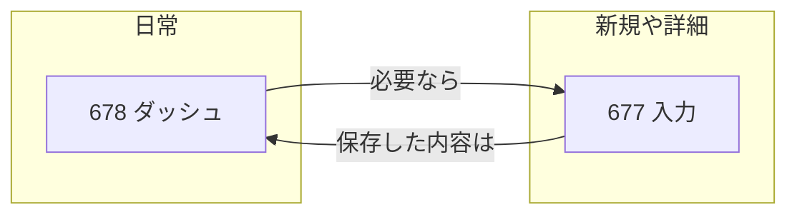

# 部署予実（予算・実績・修正）クイックマニュアル

**読む人**: システム推進室の担当者。**ここだけ読めば動ける**短さを目指した。

**本番の掲載場所（kintone）**: アプリ **[678](https://jbis-kintone.cybozu.com/k/678/)** の **「アプリの説明」**（一覧上部・HTML 表）。再反映は `npm run yojitsu:678:publish-manual-description`。

**正しい数字の置き場**: 日常の作業は **kintone だけ**。**Excel は開かない**（集計も入力もここ）。

---

## 1. 2つのアプリ

| 名前（中身） | アプリ | いつ使う？ |
|--------------|--------|------------|
| **ダッシュ**（一覧・グラフ・ボタンが多い画面） | **[678](https://jbis-kintone.cybozu.com/k/678/)** | **毎日ここから始める**。月の状況を見る・支払を足す・予算を直す多くはここ。 |
| **入力（明細の本登録）** | **[677](https://jbis-kintone.cybozu.com/k/677/)** | **新しい明細行をちゃんと作るとき**。必須項目を漏れなく入れる。 |

---

## 2. 用語ミニ辞典（1行ずつ）

- **予算**: その月で使っていい **計画の金額**。
- **実績**: **実際に払った（払う予定が確定した）金額**。日付は **「支払日／出納日」の月**に入れる（メモした日ではない）。
- **消費率**: 自動で出る。**自分で数字は入れない**。
- **予算修正**: その月の枠を **後から直す**ときの欄（運用で使う）。

---

## 3. いつもやること（チェックリスト）

1. **678 を開く**（ブックマーク推奨）。
2. いま見ている **月** が合っているか見る（画面の「入力月へジャンプ」などで切り替え）。
3. **自分の担当の行**だけを触る（他人の行は変えない）。

---

## 4. よくある作業

### A. 支払や実績を足す

1. **678** でその明細を選ぶ。
2. 画面の案内に従い **支払・実績** を入れる。
3. **保存**まで完了させる（途中で閉じない）。

### B. 新しい明細（新しいお金の行）を増やす

1. **677** を開く。
2. **新規レコード** で、工種・費用種別・会社名など **必須の欄を全部**入れる。
3. **保存**。あとで **678** に行が出てくる。

### C. 取引先（会社名）がリストにない

1. **677 の入力画面**で、仕様どおり **新しく会社を登録**してから選ぶ（言葉は画面のボタン名に合わせる）。
2. 迷ったら **室長に一声**。

### D. 月の予算枠を「はい／いいえ」で聞かれたとき（固定費など）

- **はい**: 今月から年度末まで **同じ金額を続ける**更新が走る（既定）。
- **いいえ**: **今月だけ**変える。

### E. 会社名を変える（2通り）

| 状況 | 手順 |
|------|------|
| **集合先**が FBJ・オフィスバスター・その他・他・各社・空・未設定などの行 | **678** で **入力月** を選ぶ → その月の **実績**セル（色付き）をクリックしてモーダル → 会社欄で候補から選ぶか入力し保存（**677 の会社欄**が更新される）。※集合先の「その他」と **費用種別**（固定費／変動費）は別。 |
| すでに **確定取引先** が入っている行 | **[677 一覧](https://jbis-kintone.cybozu.com/k/677/)** で該当レコードを開き会社欄を編集（**678 の一覧からは触れない**）。 |

**別ページ（表中心）**: 同じ内容を [`yojitsu-quick-manual.html`](yojitsu-quick-manual.html) にも置いています（スペース掲示などへそのまま貼れる）。

---

## 5. やってはいけないこと

- **Excel に数字を書いて戻す**（二重管理になる）。
- **権限がないのに一括処理・削除・他人の行**を触る。
- **意味が分からないボタン**を押して確かめる（まず室長または推進室）。

---

## 6. 困ったら

1. 画面の **赤いエラーメッセージ**をそのままメモする。
2. **何をしようとしたか**（例: 5月分の支払を足した）を一言書く。
3. **室長 or システム推進室**に連絡。

---

**更新**: 画面が変わったらこのファイルを直す。**詳しい仕様**は同じフォルダの `SPEC.md`。
